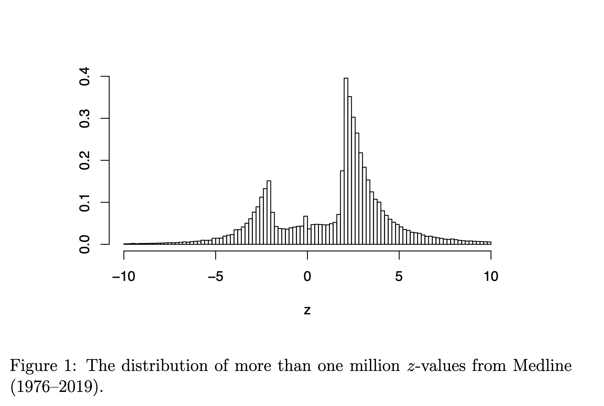

```{r setup}
library(ggplot2)
library(dplyr)
theme_set(theme_minimal(base_size = 18))
set.seed(1)
```

## Two numbers

- Open Science Collaboration (2015): 100 psychology experiments replicated.
  97 originals significant; **36%** of replications significant; effect sizes
  about **half**.
- *Nature* survey (2016), 1,576 researchers: **over 70%** had failed to
  reproduce someone else's result, **over half** their own.

## Pre-registration

{fig-align="center" height="480"}

::: {style="font-size: 0.6em"}
Large NHLBI trials. Before 2000: 17 of 30 showed benefit (57%). After
registration at clinicaltrials.gov became required: 2 of 25 (8%).
Kaplan and Irvin (2015), *PLoS ONE* 10(8): e0132382, Figure 1, CC0.
:::

## Write it down

Every study is honest. Results are written up only if significant.

Sketch the histogram of published $z$-values.

## A million $z$-values

{fig-align="center" height="440"}

::: {style="font-size: 0.6em"}
Medline abstracts, 1976--2019. "The under-representation of $z$-values between
$-2$ and $2$ is striking." van Zwet and Cator (2020), [arXiv:2009.09440](https://arxiv.org/abs/2009.09440), Figure 1.
:::

## Rejection rate and power

$$Z = \frac{\hat\mu}{\mathrm{se}} \sim N(\theta, 1),\qquad \theta = \frac{\mu}{\mathrm{se}} = \frac{\mu\sqrt n}{\sigma}$$

Reject when $|Z| > 1.96$.

- $\mu = 0$: $\;P(|Z|>c) = 2(1-\Phi(c)) = 0.05$
- otherwise: $\;\text{power}(\theta) = 1 - \Phi(c-\theta) + \Phi(-c-\theta)$

```{r power_curve, fig.height=3}
c <- qnorm(0.975)
theta <- seq(0, 5, by = 0.02)
data.frame(theta = theta, power = 1 - pnorm(c - theta) + pnorm(-c - theta)) |>
  ggplot(aes(theta, power)) + geom_line() +
  geom_hline(yintercept = c(0.05, 0.8), linetype = "dotted") +
  labs(x = expression(theta), y = "power")
```

::: {.notes}
Retrieve the se of a mean from the room. Then: which of $\mu$, $\sigma$,
$n$ does the analyst control? Thirty seconds, written.
:::

## A world of studies

```{r world}
N <- 5e4
proportion_null <- 0.4
signif_level <- qnorm(0.975)
is_null <- rbinom(N, 1, proportion_null)
effect_size_nonnull <- 0.5
simulated_world <- data.frame(is_null) |>
  mutate(zscore = rnorm(N,
                        mean = (1 - is_null) * effect_size_nonnull,
                        sd = 1 + 0.1 * (1 - is_null)))
simulated_world |>
  ggplot(aes(x = zscore, fill = factor(is_null))) +
  geom_density(alpha = 0.5) +
  geom_vline(xintercept = c(-1, 1) * signif_level, linetype = "dotted") +
  scale_fill_viridis_d(option = "magma", name = "null?")
```

## What gets published

```{r published}
proportion_filtered <- 0.9
which_studies_filtered <- rbinom(N, 1, proportion_filtered)
simulated_publications <- simulated_world |>
  mutate(filtered = which_studies_filtered) |>
  filter(filtered == 0 | abs(zscore) > signif_level)
simulated_publications |>
  ggplot(aes(zscore)) +
  geom_histogram(bins = 50)
```

Nine studies in ten are written up only if $|z| > 1.96$. Every test honest.

## Predict

Among published studies whose null was true and which had to pass the
filter: the average of $|z|$?

## The significance filter

$Z \sim N(\theta, 1)$, seen only when $Z > c$:

$$E[Z \mid Z > c] = \theta + \frac{\phi(c-\theta)}{1 - \Phi(c-\theta)}$$

$\theta = 0$, $c = 1.96$: $\quad\phi(1.96) = 0.0584,\qquad 1 - \Phi(1.96) = 0.025$

Compute $E[Z \mid Z > 1.96]$.

## 2.3 standard errors

A true null that got published is, on average, 2.3 standard errors from
zero.

Not because anyone cheated, but because you only saw it when it was large.

## Exaggeration

| $\theta$ | 0.5 | 1 | 1.5 | 2 | 2.5 | 3 | 4 |
|---|---|---|---|---|---|---|---|
| power | 0.07 | 0.17 | 0.32 | 0.52 | 0.71 | 0.85 | 0.98 |
| $E[Z \mid Z>c]$ | 2.41 | 2.49 | 2.61 | 2.77 | 2.99 | 3.27 | 4.05 |
| ratio to truth | 4.8 | 2.5 | 1.7 | 1.4 | 1.2 | 1.1 | 1.0 |

::: {style="font-size: 0.7em"}
"the relative conditional bias and the exaggeration factor are decreasing
functions of the power" -- van Zwet and Cator (2020)
:::

## Bias and variation

Power: how much the estimate varies.

Exaggeration: a bias in what gets published.

The file-drawer effect turns variance into bias.

## In pairs

How much of the replication crisis does selection alone explain, without
anyone behaving badly?

One sentence each, with a number in it if you can.

## Why most published research findings are false

Ioannidis (2005):

$$P(H_0 \text{ true} \mid \text{reject}) = \frac{(1-p)\,\alpha}{(1-p)\,\alpha + p\,(1-\beta)}$$

$p$ = share of tested hypotheses that are true; $1-\beta$ = power.

Best of $k$ null tests: $\;P(\text{some } p<0.05) = 1 - 0.95^k$, $\;=0.64$ at $k=20$.

## 208 or 20,000?

Stessman et al. (2017), *Nature Genetics*: 208 genes sequenced in 11,730 cases;
91 risk genes, 38 new.

Threshold corrected for 208 tests. Mutation counts drew on exome studies
of about 20,000 genes.

$$0.05/208 = 2.4\times10^{-4} \qquad 0.05/20{,}000 = 2.5\times10^{-6}$$

Corrected (Daly and colleagues, bioRxiv 2017): 1 of the 38 remains.

::: {style="font-size: 0.7em"}
"We should have seen that when we went across the tables, and we just didn't." -- Evan Eichler, to *Spectrum*
:::

## ASA Ethical Guidelines (2022), B.3

> "…transparent about a priori versus post hoc objectives and planned
> versus unplanned statistical practices. Discloses when multiple
> comparisons are conducted and any relevant adjustments."

## A/B testing

A company runs 200 A/B tests a year. It ships a variant only if the
measured lift is significant at 5%. Six months later it re-measures the
shipped variants.

1. Which way is the average shipped lift biased, relative to the true lifts?
2. Which ingredient of the formula does the company control, and what happens
   to the bias if it changes it?
3. Who benefits from the bias being invisible?

Individually, written.

## The standing question

> **Who benefited from that choice being invisible?**
> **And would a more competent analyst have chosen differently?**

The next two examples illustrate the second part of the standing question.

::: {.notes}
After both cases, repeat the question and take a show of hands on each.
:::

## Lucia de Berk

Convicted 2003, appeal 2004. Prosecution: 1 in 342 million that the
incidents fell on her shifts by chance.

Three wards: $p_1 \times p_2 \times p_3 \approx 1/342{,}000{,}000$.
A product of $p$-values is not a $p$-value.
Fisher: $-2\sum \log p_i \sim \chi^2_6$ gives about 1 in a million.

$P(\text{pattern} \mid \text{coincidence}) \neq P(\text{coincidence} \mid \text{pattern})$.

Incidents were classed as suspicious partly because she was there.
Recomputed (Gill and colleagues): between about 1 in 9 and 1 in 50.

Reopened 2008. Acquitted 2010.

## Ofqual, 2020

No exams. Each school submits grades and a rank order.

Student at rank $r$ of $n$ gets the grade at the $r/n$ point of the
school's predicted distribution, built from its 2017--19 results.

The student's work enters only through $r$. Cohorts under 15: teachers'
grades used.

13 August: about **36%** of A-level grades one grade below the teacher's,
**3%** two below. 17 August: withdrawn.

## Two lenses this week

- **Which comparison gets reported?** Inside a study: the best of $k$, the
  forking paths, 208 or 20,000.
- **Who is in the data?** Between studies: the literature is the published
  studies, and the file drawer is missing in a known direction.

…and why?

## Next week

Groups and averages: what an average of a group says about a member of
it, and what a feed that shows you the most extreme items does to your
picture of a group.

Required reading: David Freedman on ecological inference -- the ecological
fallacy, Goodman's regression, and the voting-rights cases where it was
used.

**Prepare and bring:** one published claim about a difference between two
groups. Write down the comparison that was reported, and one that could have
been reported instead.

# Backup

## Power of the $z$-test

$Z \sim N(\theta,1)$, reject if $|Z| > c$.

$$
\begin{aligned}
P(|Z|>c) &= P(Z > c) + P(Z < -c)\\
&= P(Z-\theta > c-\theta) + P(Z-\theta < -c-\theta)\\
&= 1 - \Phi(c-\theta) + \Phi(-c-\theta).
\end{aligned}
$$

At $\theta = 0$: $2(1-\Phi(c)) = \alpha$.

## The truncated normal mean

$$E[Z\mid Z>c] = \frac{\int_c^\infty z\,\phi(z-\theta)\,dz}{1-\Phi(c-\theta)}$$

Substitute $u = z-\theta$:

$$\int_{c-\theta}^\infty (u+\theta)\,\phi(u)\,du = \theta\,(1-\Phi(c-\theta)) + \int_{c-\theta}^\infty u\,\phi(u)\,du$$

Since $\phi'(u) = -u\,\phi(u)$: $\;\int_{c-\theta}^\infty u\,\phi(u)\,du = \phi(c-\theta)$.

$$\Rightarrow\quad E[Z\mid Z>c] = \theta + \frac{\phi(c-\theta)}{1-\Phi(c-\theta)}$$

## The false discovery proportion

Share $p$ of tested hypotheses true; level $\alpha$; power $1-\beta$.

$$P(\text{reject}) = (1-p)\,\alpha + p\,(1-\beta)$$

$$P(H_0\mid \text{reject}) = \frac{(1-p)\,\alpha}{(1-p)\,\alpha + p\,(1-\beta)}$$

| $p$ | power | $P(H_0\mid\text{reject})$ |
|---|---|---|
| 0.5 | 0.8 | 0.06 |
| 0.1 | 0.8 | 0.36 |
| 0.1 | 0.2 | 0.69 |
