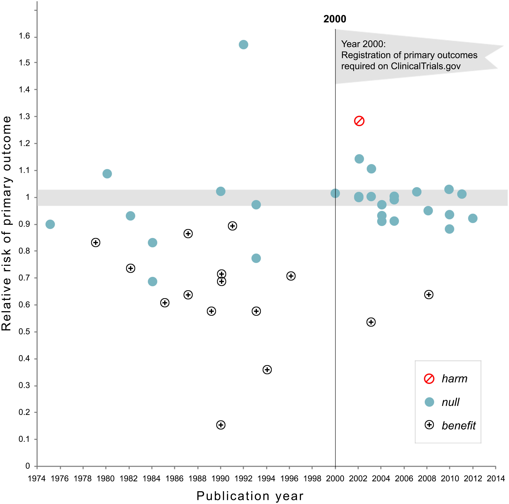

[Slides](../slides/01-selection.qmd) · [Class sheet](../class/01-selection.qmd)


## Preamble: purpose of the course

Much of what goes wrong in data science does not announce itself as an
ethical problem. It appears as a technical step: a threshold, a filter, a
choice of outcome variable, a decision about which rows to keep. The step
looks neutral, someone takes the default, and a value judgement has been
made without anyone noticing. This course is about those steps. The formal
content, mostly probability you already know and some causal modelling you
may not, is there to make the hidden choice visible.

There are five questions we will keep asking, lenses that bring hidden
choices into focus.

- **What are we optimising or predicting?** Whose definition of the outcome
  governs.
- **Who is in the data?** Whether the unseen are like the seen, and who
  decided.
- **Which comparison gets reported?** Whether the question was fixed before
  the answer.
- **Who bears the error?** What each kind of mistake costs, and on whom
  that cost falls.
- **You have to choose, so choose, and defend it.** Sometimes the
  mathematics proves that a choice is unavoidable. Pretending it was forced
  is its own failure.

Each of these ends with the same two words: *and why?*

There is also a question the lenses cannot answer:

> **Who benefited from that choice being invisible? And would a more
> competent analyst have chosen differently?**

Sometimes the answer is yes and the fix is better statistics. Sometimes the
answer is no: the technique was defensible and the harm came from somewhere
else.

**Important note:** my views on these topics are not a consensus. You are not expected
to adopt them, and a well-argued position I think is wrong can still get
full marks. What is assessed is whether you can find a defensible position,
say what it assumes, and defend it against the strongest objection.

## Summary

Science has a replication problem. Some of it is fraud and some is
incompetence, but a surprising amount needs neither. If a result is more
likely to be published when it is significant, the published literature is
a filtered sample of the studies that were run, and the filter changes what
the published numbers mean. We build that filter in a simulation, derive
what it does to an estimate, and then ask who benefited from the filter
being invisible.

## The replication crisis

A study is *replicated* when an independent team repeats it with new data
and finds the same thing: an effect in the same direction, of similar size,
and usually significant again. Replication is supposed to be routine. It
turns out to be rare, and when it is attempted it often fails.

In 2015 the Open Science Collaboration replicated 100 published psychology
experiments. Of the 97 originals that had reported significant effects,
36% replicated at $p < 0.05$, and the replication effect sizes were about
half the originals. In 2016 *Nature* surveyed 1,576 researchers. More than
70% had tried and failed to reproduce someone else's result, and more than
half had failed to reproduce one of their own. The citations are in
[Wikipedia: Replication crisis](https://en.wikipedia.org/wiki/Replication_crisis).

Here is what happened to one set of trials when registration became
required. Kaplan and Irvin (2015) looked at 55 large trials of drugs and
supplements funded by the US National Heart, Lung and Blood Institute.
Before 2000, 17 of 30 (57%) found a significant benefit. From 2000, trials
had to register their primary outcome at clinicaltrials.gov before
collecting data. After that, 2 of 25 (8%).



Same funder, same kind of trial, same statistics. What changed is that the
comparison had to be chosen before the data could influence it.

Here is a second picture, a histogram. Van Zwet and Cator (2020)
collected over a million $z$-values from Medline abstracts published
between 1976 and 2019. A $z$-value is an estimate divided by its standard
error.

.](../files/vanzwet_cator_2020_fig1.png)

It is striking how large the hole in the histogram is: values between
$-2$ and $2$ are missing in bulk. Results that were not significant were
far less likely to appear.

Two explanations are on the table. The first is misconduct and
incompetence, and there is plenty of both; see the hall of shame in the
optional readings. The second is that nobody has to behave badly for the
picture to look like that. A journal preferring significant results, a
researcher writing up the study that worked, a reader citing the surprising
finding: each one is a filter. Let's take the second explanation seriously
enough to build it.

## Rejection rates and power

You estimate a quantity $\mu$ with an estimator $\hat\mu$ whose standard
error is $\mathrm{se}$. Standardise:
$$
Z = \frac{\hat\mu}{\mathrm{se}} \sim N(\theta, 1), \qquad \theta = \frac{\mu}{\mathrm{se}}.
$$
For a sample mean with $n$ observations and noise standard deviation
$\sigma$, $\mathrm{se} = \sigma/\sqrt n$ and $\theta = \mu\sqrt n/\sigma$.
The two-sided test at level $\alpha = 0.05$ rejects when $|Z| > c$ with
$c = 1.96$.

Under the null hypothesis $\mu = 0$, so $\theta = 0$ and
$$
P(|Z| > c \mid \mu = 0) = 2\,(1 - \Phi(c)) = 0.05 .
$$
This is the rejection rate under the null, the error rate the test
advertises.

When $\mu \neq 0$ the rejection probability is the **power**,
$$
\text{power}(\theta) = P(|Z| > c) = 1 - \Phi(c - \theta) + \Phi(-c - \theta).
$$
Everything about the study enters through the single number $\theta$.

```{r power_curve, echo=FALSE, message=FALSE, fig.height=3.2}
library(ggplot2)
library(dplyr)
theme_set(theme_minimal())
c <- qnorm(0.975)
theta <- seq(0, 5, by = 0.02)
power_df <- data.frame(theta = theta,
                       power = 1 - pnorm(c - theta) + pnorm(-c - theta))
ggplot(power_df, aes(theta, power)) +
  geom_line() +
  geom_hline(yintercept = 0.05, linetype = "dotted") +
  geom_hline(yintercept = 0.80, linetype = "dotted") +
  labs(x = expression(theta == mu * sqrt(n) / sigma), y = "power")
```

| $\theta$ | 0 | 0.5 | 1 | 1.5 | 2 | 2.5 | 2.8 | 3 | 4 |
|---|---|---|---|---|---|---|---|---|---|
| power | 0.05 | 0.08 | 0.17 | 0.32 | 0.52 | 0.71 | 0.80 | 0.85 | 0.98 |

Which of $\mu$, $\sigma$ and $n$ does the analyst control? Usually only
$n$. The effect is whatever it is, and $\sigma$ is a property of the
measurement. So power at a fixed $\mu$ is a statement about how much the
estimate varies: the same $\mu$ estimated with a wider standard error is
caught less often.

### The rates in a simulation

The function below generates a dataset with an outcome $Y$, a covariate
$X$ and a binary group $A$ from a linear model with whatever coefficients
you choose. With every coefficient at zero, $Y$ is pure noise and every
regression coefficient is a null hypothesis that happens to be true.

```{r sim_setup, message=FALSE}
set.seed(1)

generate_data <- function(beta0 = 0, betaX = 0, betaA = 0, betaXA = 0,
                          n = 200, proportion = 1/2) {
  X <- rnorm(n)
  A <- rbinom(n, 1, proportion)
  Y <- beta0 + betaX * X + betaA * A + betaXA * X * A + rnorm(n, sd = 1)
  data.frame(Y = Y, X = X, A = factor(A))
}

# One experiment: generate data, fit the model, return the p-value for X
one_experiment <- function(beta0 = 0, betaX = 0, betaA = 0, betaXA = 0,
                           n = 200, proportion = 1/2) {
  one_sample <- generate_data(beta0, betaX, betaA, betaXA, n, proportion)
  one_fit <- lm(Y ~ X + A + X * A, one_sample)
  summary(one_fit)$coefficients[2, 4]
}
```

Run it many times under the null and count how often $p < 0.05$.

```{r sim_null}
rejection_level <- 0.05
n_experiments <- 2000
mean(replicate(n_experiments, one_experiment()) < rejection_level)
```

Close to 0.05, as it should be. Now give $X$ a small real effect and watch
the rejection rate rise with $n$.

```{r sim_power}
sapply(c(100, 200, 400, 800), function(n)
  mean(replicate(n_experiments, one_experiment(betaX = 0.2, n = n)) < rejection_level))
```

A coefficient of 0.2 is caught about half the time at $n = 200$ and about
80% of the time near $n = 400$. Can you predict those numbers from the
table? The coefficient on $X$ in `Y ~ X + A + X * A` is the slope *within
the group $A = 0$*, so it is estimated from roughly half the sample, and
$\theta \approx 0.2\sqrt{n/2}$. At $n = 400$ that is $\theta \approx 2.8$.
The simulation and the formula agree. Check that first, every time, for
both.

## Simulating publication bias

Now the filter. Simulate a world of many studies. Some test hypotheses that
are true nulls; the rest test real effects of modest size. Every test is
done honestly. The only thing that goes wrong is that most results are
written up only if they are significant. The rest stay in the file
drawer, which is why this is called the file-drawer effect.

```{r sim_world}
set.seed(1)
N <- 5e4                     # studies conducted
proportion_null <- 0.4
signif_level <- qnorm(0.975)
is_null <- rbinom(N, 1, proportion_null)
effect_size_nonnull <- 0.5
simulated_world <- data.frame(is_null) |>
  mutate(zscore = rnorm(N,
                        mean = (1 - is_null) * effect_size_nonnull,
                        sd = 1 + 0.1 * (1 - is_null)))
```

The $z$-scores have mean zero and standard deviation one when the null is
true, and a slightly larger mean and spread when it is false. Here is the
world before anybody decides what to publish.

```{r plot_world}
simulated_world |>
  ggplot(aes(x = zscore, fill = factor(is_null))) +
  geom_density(alpha = 0.5) +
  geom_vline(xintercept = c(-1, 1) * signif_level, linetype = "dotted") +
  scale_fill_viridis_d(option = "magma", name = "null?")
```

Nobody sees this plot. An analyst does not know which of their hypotheses
are null, and neither does a journal. The literature sees the subset that
passes the filter.

```{r sim_filter}
proportion_filtered <- 0.9
which_studies_filtered <- rbinom(N, 1, proportion_filtered)
simulated_publications <- simulated_world |>
  mutate(filtered = which_studies_filtered) |>
  filter(filtered == 0 |                 # published regardless, OR
         abs(zscore) > signif_level)     # large enough to pass the filter
nrow(simulated_publications)
```

```{r plot_filter}
simulated_publications |>
  ggplot(aes(zscore)) +
  geom_histogram(bins = 50)
```

Compare this with the Medline histogram. In the simulation, the hole
between $-1.96$ and $1.96$ appeared without a single dishonest test. The
Medline histogram surely contains some dishonest ones, but it does not
need them to look the way it does.

Before reading on, guess the average of $|z|$ among the published studies
whose null hypothesis was true and which had to pass the filter. Then
check:

```{r filtered_null_mean}
simulated_publications |>
  filter(is_null == 1, filtered == 1) |>
  summarise(mean_abs_z = mean(abs(zscore)), n = n())
```

## The significance filter

That number is not an accident of the simulation. It is a property of the
normal distribution.

Suppose $Z \sim N(\theta, 1)$ and we only get to see $Z$ when $Z > c$.
What is the expected value of what we see? Write $u = z - \theta$, so that
$u$ is standard normal and the condition becomes $u > c - \theta$:
$$
E[Z \mid Z > c]
= \frac{\int_c^\infty z\,\phi(z - \theta)\,dz}{P(Z > c)}
= \frac{\int_{c-\theta}^\infty (u + \theta)\,\phi(u)\,du}{1 - \Phi(c - \theta)} .
$$
The $\theta$ part of the numerator integrates to
$\theta\,(1 - \Phi(c-\theta))$. For the $u$ part, $\phi'(u) = -u\,\phi(u)$,
so $\int_{c-\theta}^\infty u\,\phi(u)\,du = \phi(c - \theta)$. Therefore
$$
\boxed{\;E[Z \mid Z > c] = \theta + \frac{\phi(c - \theta)}{1 - \Phi(c - \theta)}\;}
$$
The second term is the bias induced by the filter. It is always positive,
and its denominator is the power of a one-sided test at threshold $c$.

**Under the null.** Put $\theta = 0$ and $c = 1.96$. Then
$\phi(1.96) = 0.0584$ and $1 - \Phi(1.96) = 0.025$, so
$$
E[Z \mid Z > 1.96] = \frac{0.0584}{0.025} \approx 2.34 .
$$
By symmetry the same number is $E[\,|Z|\, \mid |Z| > 1.96]$ for the
two-sided filter. A true null effect that passed the filter is, on average,
2.3 standard errors from zero. The estimate is not wrong because someone
cheated, but because you only got to see it when it was large. This is
called the winner's curse.

### The filter on its own

You do not need the whole simulated world to see this. Generate null
$z$-scores, keep the ones that pass, and look at what survived.

```{r thresholded_z}
z <- rnorm(1e5)                       # every null hypothesis true
survivors <- z[abs(z) > 1.96]
length(survivors) / length(z)         # should be about 0.05
mean(abs(survivors))                  # compare with phi(1.96) / 0.025
```

```{r thresholded_z_plot}
data.frame(z = survivors) |>
  ggplot(aes(z)) +
  geom_histogram(bins = 60) +
  geom_vline(xintercept = c(-1.96, 1.96), linetype = "dotted")
```

Nothing in the survivors' distribution is near zero, and none of them
tells you it came through a filter.

### Exaggeration

The null case is the extreme. What does the filter do to true effects?

For $\theta > 0$ the boxed formula gives the expected published estimate.
Its ratio to the truth, $E[Z \mid Z > c]/\theta$, is how much a published
estimate exaggerates on average. Here it is for a few values, with the
one-sided power at $c = 1.96$:

| $\theta$ | 0.5 | 1 | 1.5 | 2 | 2.5 | 3 | 4 |
|---|---|---|---|---|---|---|---|
| power | 0.07 | 0.17 | 0.32 | 0.52 | 0.71 | 0.85 | 0.98 |
| $E[Z \mid Z > c]$ | 2.41 | 2.49 | 2.61 | 2.77 | 2.99 | 3.27 | 4.05 |
| exaggeration ratio | 4.8 | 2.5 | 1.7 | 1.4 | 1.2 | 1.1 | 1.0 |

A study with 17% power that reaches significance reports, on average, two
and a half times the true effect. A study with 85% power overstates it by
about a tenth. Van Zwet and Cator prove the general statement: the
exaggeration factor is a decreasing function of the power, and if the
power is 50% or less, the usual 95% confidence interval on a significant
result does not reach its nominal coverage. (Their formula is for the
two-sided filter on $|Z|$; for $\theta \ge 1$ it gives the same numbers as
the one-sided version in the table, to two decimals.)

Put the two halves together. The power of a study is about how much its
estimate varies. The exaggeration of a published estimate is a bias. The
file-drawer effect turns variance into bias. So when you are shown an
estimate, ask whether the problem is bias, variance, or both.

### What the model leaves out

Two things, both of which make matters worse. A two-sided filter also lets
through estimates of the wrong sign, so a low-powered study can produce a
significant result pointing the wrong way. And real filters are softer
than a hard threshold and act at several stages. Neither changes the
direction of anything above.

### Optional: sign and magnitude errors

Gelman and Carlin (2014) give the two consequences of the filter names.
A *Type M* (magnitude) error is the exaggeration ratio above. A *Type S*
(sign) error is a significant estimate with the wrong sign. For the
two-sided filter its probability is
$$
P(Z < -c \mid |Z| > c) = \frac{\Phi(-c-\theta)}{1 - \Phi(c-\theta) + \Phi(-c-\theta)} ,
$$
the lower tail's share of what passes.

| $\theta$ | 0.25 | 0.5 | 1 | 1.5 | 2 |
|---|---|---|---|---|---|
| power | 0.06 | 0.08 | 0.17 | 0.32 | 0.52 |
| wrong sign, given significant | 0.24 | 0.09 | 0.01 | 0.001 | 0.0001 |

At 6% power, nearly a quarter of the significant results point the wrong
way. By 30% power the problem has gone, while the magnitude error is
still a factor of 1.7. So the two errors have different cures: a little
more power removes sign errors, and a lot more power is needed before the
exaggeration is small.

### Optional and advanced: shrinkage, an empirical Bayes view

Everything above conditions on selection: it averages over the estimates
that passed. A Bayesian asks a different question. Given this $z$, what
is $\theta$ likely to be? Answering it needs a distribution for $\theta$
across the studies being done. Suppose the standardised effects in a
field are
$$
\theta \sim N(0, \tau^2), \qquad Z \mid \theta \sim N(\theta, 1).
$$
Then marginally $Z \sim N(0, 1 + \tau^2)$, and
$$
\theta \mid Z = z \;\sim\; N\!\left( \frac{\tau^2}{1 + \tau^2}\, z,\; \frac{\tau^2}{1 + \tau^2} \right).
$$
The posterior mean shrinks $z$ towards zero by the factor
$\tau^2/(1+\tau^2)$. With $\tau = 1$, a field where the typical study has
power under 20%, a just-significant $z = 1.96$ is best read as about
$0.98$. The frequentist calculation from the other direction gave
$1.96/2.5 \approx 0.8$ at $\theta = 1$. Different questions, similar
answers.

Two things follow. First, the selection rule does not appear in the
posterior. The filter acts on $z$, and once you condition on $z$ it has
nothing more to say. The bias in the frequentist calculation comes from
averaging over what was selected; the Bayesian conditions on what was
seen. You can check this by simulation:

```{r shrinkage}
set.seed(2)
tau <- 1
theta_true <- rnorm(2e5, 0, tau)
z <- theta_true + rnorm(2e5)
significant <- z > 1.96
mean(z[significant] - theta_true[significant])        # the raw estimate, among the selected
mean(z[significant] / 2 - theta_true[significant])    # the shrunk estimate, among the selected
```

The raw estimate overshoots by more than one standard error on average
among the significant results; the shrunk estimate does not overshoot at
all.

Second, $\tau$ is not known, but it can be estimated from an
*unfiltered* collection of $z$-values, since $\mathrm{Var}(Z) = 1 +
\tau^2$. This is empirical Bayes. Do it on a filtered collection and the
answer is wrong in a predictable direction: the filter removes the small
$|z|$, the variance is inflated, $\hat\tau^2$ comes out too large and the
shrinkage too weak. Van Zwet, Schwab and Senn (2021) did it on 23,747
$z$-values from trials in the Cochrane database, which records trials
whatever their outcome, using a mixture of normals rather than a single
one. They estimate the median achieved power of a trial to be 0.13, and
that an estimate just significant at the 5% level overstates the true
effect by a factor of about 1.7. Their conclusion is in the title of the
paper that gave us the Medline histogram: the need to shrink.

## Many comparisons

The filter does not have to sit between studies. It can sit inside one. If
an analyst runs $k$ independent tests of true null hypotheses and reports
the smallest $p$-value, the chance that at least one is below 0.05 is
$$
1 - 0.95^k ,
$$
which is 0.23 at $k = 5$, 0.40 at $k = 10$ and 0.64 at $k = 20$. Reporting
the best of $k$ is the significance filter applied to one analyst's own
work.

The analyst need not literally run all $k$. Gelman and Loken call this the
*garden of forking paths*. An analysis involves many choices: which
outcome, which subgroup, which covariates, which outliers to drop,
one-sided or two-sided. If the choice depends on the data, the reported
test behaves as though the alternatives had been run, even when they were
not. The researcher who "just looked at the data first" is in a similar
position to the one who ran twenty tests, and it is harder to count the
paths.

Here is a recent example from genetics. In 2017 a large team reported 91
genes linked to neurodevelopmental disorders, 38 of them new (Stessman et
al., *Nature Genetics*). They had sequenced 208 candidate genes in more
than 11,000 cases. To decide which genes had more mutations than chance
would produce they needed a significance threshold corrected for the
number of genes tested, and they used 208. But the mutation counts combined
their own data with earlier studies that had sequenced the whole exome,
around 20,000 genes, and a mutation found by searching 20,000 genes is much
less surprising than one found by searching 208. A group of geneticists
led by Mark Daly pointed this out within a month. Redone with the larger
denominator, one of the 38 new genes remained. To see the size of the
error: a Bonferroni threshold at 5% is $0.05/208 = 2.4 \times 10^{-4}$ for
208 tests and $0.05/20{,}000 = 2.5 \times 10^{-6}$ for 20,000. A factor of
a hundred in the threshold was the difference between 38 discoveries and
one. Nobody fabricated anything. The senior author's comment to
[Spectrum](https://www.thetransmitter.org/spectrum/researchers-correct-statistical-flaw-high-profile-paper/):
"We should have seen that when we went across the tables, and we just
didn't."

The remedy has a name, **pre-specification** or pre-registration: fix the
analysis before the data can influence it. It does not make a test more
powerful. It makes the reported comparison the one that was planned. The
NHLBI trials above are what that looks like at the scale of a field.

The profession's own code says the same thing. The American Statistical
Association's guidelines (2022 revision, item B.3) ask the practitioner to
be "transparent about a priori versus post hoc objectives and planned
versus unplanned statistical practices" and to disclose "when multiple
comparisons are conducted and any relevant adjustments." If you wonder why
an ethics course is teaching you about power and selection, this is why.

## How much of the crisis does selection alone explain?

Ioannidis (2005) asked a simple question. Among the hypotheses a field
tests, suppose a share $p$ are true. Tests are run at level $\alpha$ with
power $1 - \beta$. In the long run, what fraction of *rejections* are
false? By Bayes' rule,
$$
P(H_0 \text{ true} \mid \text{reject})
= \frac{(1 - p)\,\alpha}{(1 - p)\,\alpha + p\,(1 - \beta)} .
$$
The complement is what he calls the positive predictive value of a
research finding. With $\alpha = 0.05$:

| $p$ | power | $P(H_0 \mid \text{reject})$ |
|---|---|---|
| 0.5 | 0.8 | 0.06 |
| 0.5 | 0.2 | 0.20 |
| 0.1 | 0.8 | 0.36 |
| 0.1 | 0.2 | 0.69 |

A field where true effects are rare and studies are small will have a
literature in which most significant findings are false, with no
misconduct at all. Each ingredient is one of this week's ideas: $\alpha$ is
the advertised error rate, the power is the variation, and $p$ is about
who is in the data, because a field that tests wild hypotheses has a
different literature from one that tests safe ones.

What the formula does not show is that most published findings in any
*particular* field are false. Nobody observes $p$. Ioannidis's title is a
claim about the range of $p$ and power he considered plausible, and you can
disagree with the range without disagreeing with the arithmetic.

The same arithmetic, with a risk score in place of a $p$-value, describes a
classifier that flags people rather than hypotheses. We will do it again.

## Two lenses

Which comparison gets reported? Inside a study: the best of $k$ tests,
the forking paths, the 208 genes.

Who is in the data? Between studies. For anyone reading the literature,
the data are the published studies, and the ones in the file drawer are
missing in a known direction. A meta-analysis that pools every published
trial has a sample chosen by the filter, and Ioannidis's $p$ is a
statement about which hypotheses a field puts into the data at all.

And why? Because the filter serves someone: the journal that prefers
positive results, the author whose career depends on them, the reader who
prefers a story.

## Two cases

*Would a more competent analyst have chosen differently?* One case where
the answer is yes and one where it is no.

**Lucia de Berk.** A Dutch nurse was convicted in 2003, and again on appeal
in 2004, of murders and attempted murders. Part of the evidence was a
calculation: the chance that the deaths and resuscitations on her wards
would all fall on her shifts by coincidence was put at 1 in 342 million.
The number came from three wards. For each ward the statistician computed
the probability that a nurse working her share of shifts would be present
at that many incidents, and then multiplied the three probabilities
together.

Two things are wrong with that before we even get to the data. A product
of three $p$-values is not a $p$-value. Combining them properly (Fisher's
method, $-2\sum_i \log p_i \sim \chi^2_6$ under the null) gives about one
in a million, not one in 342 million. And $P(\text{this pattern} \mid
\text{coincidence})$ is not $P(\text{coincidence} \mid \text{this
pattern})$. To get from one to the other you need the prior probability
that a nurse is a murderer and the number of nurses whose shifts could have
been examined. Then the data: incidents had been classified as suspicious
partly because she was present at them, and some incidents counted against
her happened when she was not on the ward. Recomputed by Richard Gill and
colleagues with corrected data, the chance came out somewhere between
about 1 in 9 and 1 in 50, depending on what is assumed about how incident
rates vary between nurses. The case was reopened in 2008 and she was
acquitted in 2010. A more competent analyst would have refused to compute
the number that way. Yes.

**Ofqual, 2020.** Exams were cancelled and England's regulator had to
produce grades without them. Teachers submitted a grade for each student
and a rank order within each school and subject. The model then replaced
the grades with a predicted grade distribution for the school, built from
the school's own results in 2017 to 2019 and adjusted for the cohort's
prior attainment: the student at rank $r$ of $n$ received the grade at the
$r/n$ point of that distribution. The student's own work entered only
through $r$. Two students with identical work at different schools got
different grades, and a school whose past cohorts had few top grades could
award few this year. For small cohorts (under 15) the teachers' grades were
used, wholly or in part. Small classes are commoner in private schools,
which is where the widely reported private-school advantage came from. On
results day, 13 August, about 36% of A-level grades were one grade below
the teacher's and 3% two grades below. On 17 August the model was
withdrawn and the teachers' grades were used instead.

As statistics the model was defensible. A regulator told to hold the grade
distribution steady without any exams has to standardise against
something, and the school's own history is a reasonable something. The
trouble was not the arithmetic. A rule about school histories was used to
decide individual futures, the cost fell on students who had no way to
contest it, and more statistical training at the regulator would not have
changed that. No.

If your answer is "better statistics would have fixed it" every time, or
"the statistics were fine, it's all politics" every time, you need to
recalibrate.

## Readings

### Required

- [ms4ds, chapter 3: Ethical data science](https://joshualoftus.com/ms4ds/ethical-data-science.html),
  sections 3.1 to 3.6. Start it now and read it gradually. It is a
  compressed version of a large part of the course, and you will come back
  to it.
- [Wikipedia: Replication crisis](https://en.wikipedia.org/wiki/Replication_crisis),
  skim.

### Optional

- Ioannidis, [Why Most Published Research Findings Are False](https://journals.plos.org/plosmedicine/article?id=10.1371/journal.pmed.0020124)
  (2005). The calculation above, and six corollaries worth arguing with.
- Open Science Collaboration, [Estimating the reproducibility of psychological science](https://www.science.org/doi/10.1126/science.aac4716)
  (2015).
- Kaplan and Irvin, [Likelihood of Null Effects of Large NHLBI Clinical Trials Has Increased over Time](https://journals.plos.org/plosone/article?id=10.1371/journal.pone.0132382)
  (2015). The figure above.
- van Zwet and Cator, [The significance filter, the winner's curse and the need to shrink](https://arxiv.org/abs/2009.09440)
  (2020). The Medline histogram and the theorem about power.
- Gelman and Loken, [The garden of forking paths](https://sites.stat.columbia.edu/gelman/research/unpublished/forking.pdf)
  (2013).
- Gelman and Carlin, [Beyond power calculations: assessing Type S (sign) and Type M (magnitude) errors](https://doi.org/10.1177/1745691614551642)
  (2014).
- van Zwet, Schwab and Senn, [The statistical properties of RCTs and a proposal for shrinkage](https://arxiv.org/abs/2011.15004)
  (2021). The empirical Bayes calculation in the advanced section.
- Wright, [Researchers correct statistical flaw in high-profile autism paper](https://www.thetransmitter.org/spectrum/researchers-correct-statistical-flaw-high-profile-paper/)
  (Spectrum, 2017), on the Stessman et al. correction.
- The research hall of shame: [Wansink](https://www.buzzfeednews.com/article/stephaniemlee/brian-wansink-cornell-p-hacking),
  [Zimbardo](http://letexier.org/IMG/pdf/LeTexier_Debunking-the-SPE_American-Psychologist_2019.pdf).

## Computer setup

First [install R](https://cran.r-project.org/) and then
[RStudio](https://posit.co/download/rstudio-desktop/) (recommended, not
required, if you prefer another editor and know what you are doing). Then
install the tidyverse packages:

```
install.packages("tidyverse")
```

On a Mac or Linux machine you may prefer a package manager. If you have
not used R before, the LSE Digital Skills Lab's short
[pre-sessional R course](https://moodle.lse.ac.uk/course/view.php?id=8714)
is the quickest way in. The class assumes you can run and edit a script
like the ones above.
