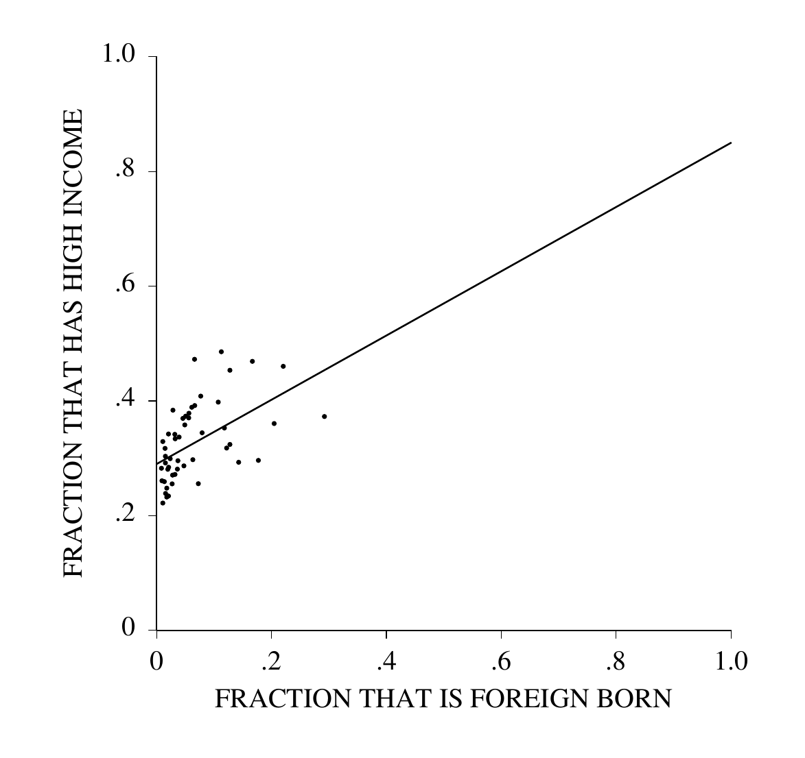
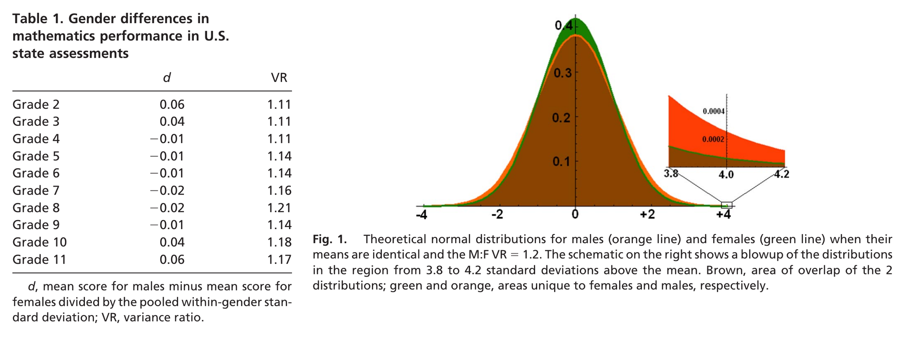
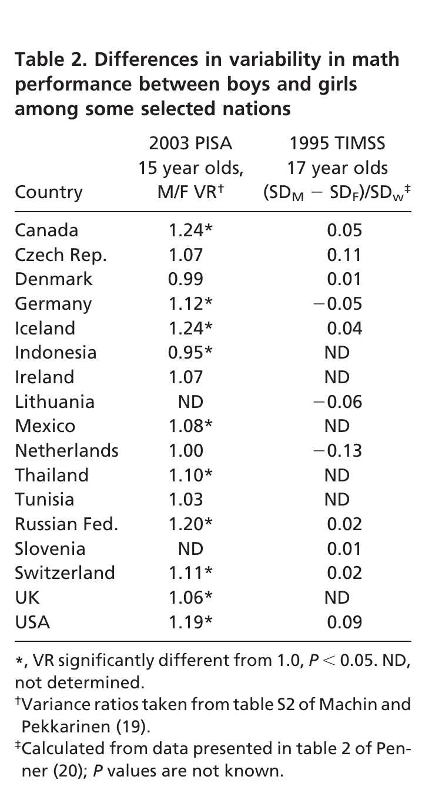
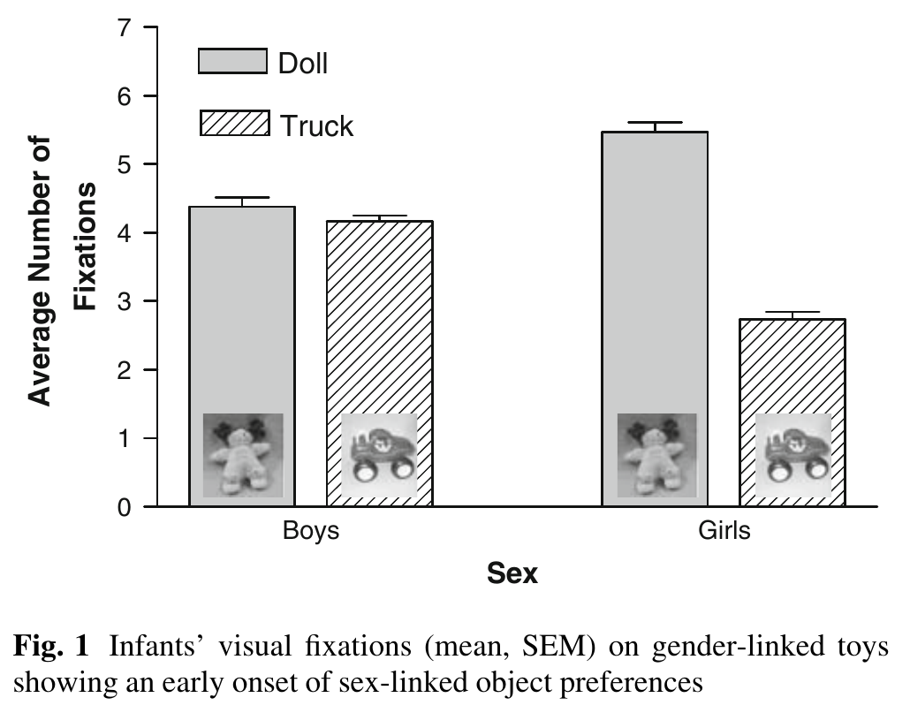
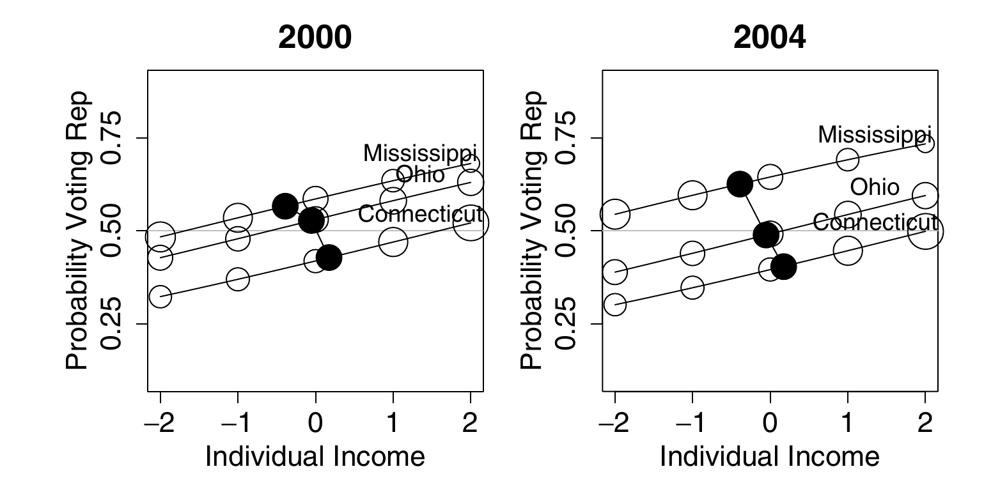

**Important note:** the second half of this week is about claims that
one group of people differs from another. Some of the examples are
politically charged and some of the findings are contested. The
readings of them here are my own. You are not expected to share them,
and a well-argued position I think is wrong can still get full marks.
The arithmetic is not contested. It tells you which questions to ask
of a group difference before you believe it, whoever is making the
claim.

## Summary

Cargo cult science is Richard Feynman's name for research that has the
form of science without the substance. Stark and Saltelli say much of
statistics is practiced that way, and Gigerenzer calls the result
mindless statistics, the first half of this week's title: a ritual of
null hypotheses and 5% levels, performed whatever the question and
misunderstood by many of the people who perform it and teach it.
Feynman's first principle is that "you must not fool yourself--and you
are the easiest person to fool."

Correct statistics can fool you too. A correlation across fifty states
says the foreign-born have the higher incomes, and a survey of people
says the opposite. Averaging removes the variation among people, so a
relationship can be far tighter across areas than among the people who
live in them, and $R^2$ is often read as saying more than it does. A
decision about a person made from the average of a group they belong
to is called statistical discrimination. A small difference in spread
between two groups becomes a large ratio far out in the tail, by
arithmetic that is correct, and the second half of the title is about
an argument that uses that arithmetic. A feed that shows the most
extreme item from each of two groups shows more extreme items from the
larger group, even when the two groups are alike.

Three numbers in these notes were computed correctly: a $p$-value of
0.01, a correlation of 0.52 and an 18% share of a tail. Each answers
one question and is easily read as the answer to another.

```{r setup, echo=FALSE, message=FALSE}
library(ggplot2)
library(dplyr)
library(patchwork)
theme_set(theme_minimal())
# cividis: viridisLite::cividis(9)[c(1, 3, 5, 6, 7, 9)]
navy <- "#00204D"; slate <- "#414D6B"; cgray <- "#7C7B78"; khaki <- "#9B9477"; gold <- "#BCAF6F"; yellow <- "#FFEA46"
dgold <- "#6E5F00"                 # the theme's dark gold, for text and thin lines on white
two <- c(navy, gold)               # the two groups, wherever there are two
```

## Cargo cult science

In his 1974 commencement address at Caltech, Richard Feynman described
islanders in the South Pacific who had watched airfields operate
during the war and wanted the cargo to come back. They built runways,
lit fires along them, and put a man in a wooden hut with wooden
headphones.

> "They're doing everything right. The form is perfect. It looks
> exactly the way it looked before. But it doesn't work. No airplanes
> land."

Cargo cult science was his name for research that follows "all the
apparent precepts and forms of scientific investigation" and is
"missing something essential."

## Cargo-cult statistics

[Stark and Saltelli](https://significancemagazine.com/cargo-cult-statistics-and-scientific-crisis/),
this week's first required reading, apply the image to our subject:

> "In our experience, many applications of statistics are cargo-cult
> statistics: practitioners go through the motions of fitting models,
> computing *p*-values or confidence intervals, or simulating posterior
> distributions. They invoke statistical terms and procedures as
> incantations, with scant understanding of the assumptions or
> relevance of the calculations, or even the meaning of the
> terminology. This demotes statistics from a **way of thinking** about
> evidence and **avoiding self-deception** to a formal 'blessing' of
> claims."

(Emphasis added.) Their short version is "the ritualistic miming of statistics rather
than conscientious practice," and of what the miming achieves they
say: "The calculations are as likely to produce valid inferences as
cargo cults were to summon cargo planes."

It "has become the norm in many disciplines, reinforced and abetted
by statistical education, statistical software, and editorial
policies." The first two are close to home. Many statistics courses,
in their experience, "teach cargo-cult statistics: mechanical
calculations with little attention to scientific context, experimental
design, assumptions and limitations of methods, or the interpretation
of results." And:

> "Statistical software does not help you know what to compute, nor
> how to interpret the result. ... The more 'powerful' and
> 'user-friendly' the software is, the more it invites cargo-cult
> statistics."

That was written in 2018. What would they say about software that
writes the analysis for you?

Their explanation of how this became the norm is historical. "After
World War II, governments increased funding for science in response to
the assessment that scientific progress is important for national
security, prosperity, and quality of life. This increased the scale of
science and the pool of scientific labour: science became 'big
science' conducted by career professionals." With the scale came the
management of it, and "the norms and self-regulating aspects of
'little science'--communities that valued questioning, craftsmanship,
scepticism, self-doubt, critical appraisal of the quality of evidence,
and the verifiable, and verifiably replicable, advancement of human
knowledge--gave way to current approaches centring on metrics,
funding, publication, and prestige."

Their last section is about what statisticians can do:

> "Statisticians can help with important, controversial issues with
> immediate consequences for society. We can help fight power
> asymmetries in the use of evidence. We can stand up for the
> responsible use of statistics, even when that means taking personal
> risks."

That means being "vocally critical" of cargo-cult statistics,
including "where probabilities are calculated under irrelevant,
misleading assumptions," objecting "whether or not we like the
conclusion," and being "critical even when the abuses involve
politically charged issues." The second half of this week is one.

## The first principle

What cargo cult science is missing, Feynman said, is "a kind of
scientific integrity, a principle of scientific thought that
corresponds to a kind of utter honesty--a kind of leaning over
backwards." If you are doing an experiment, "you should report
everything that you think might make it invalid--not only what you
think is right about it." And: "Details that could throw doubt on your
interpretation must be given, if you know them." The idea is to "give
all of the information to help others to judge the value of your
contribution."

> "The first principle is that you must not fool yourself--and you are
> the easiest person to fool."

One of his examples is last week's file drawer, in 1974:

> "If we only publish results of a certain kind, we can make the
> argument look good. We must publish both kinds of result. ... In
> other words, publication probability depends upon the answer. That
> should not be done."

Another is an experiment he admired. In 1937, as Feynman tells it, a
man named Young wanted rats to learn to go in at the third door along
from wherever they started. They went straight to the door where the
food had been the time before. Young repainted the doors, changed the
smell with chemicals, and covered the corridor so that the rats could
not see the room. They could still tell. They were going by how the
floor sounded, and only when he set the corridor in sand did they have
to learn the task. Later experimenters ran rats in the old way and did
not cite him, "because he didn't discover anything about the rats. In
fact, he discovered all the things you have to do to discover
something about rats."

He ended with a wish for the graduating class:

> "... the good luck to be somewhere where you are free to maintain
> the kind of integrity I have described, and where you do not feel
> forced by a need to maintain your position in the organization, or
> financial support, or so on, to lose your integrity. May you have
> that freedom."

The first principle is where one of the course's lenses starts. **You
have to choose, so choose, and defend it.** Sometimes the mathematics
proves that a choice is unavoidable. Pretending it was forced is its
own failure. In an analysis the hypothesis, the level, the test and
what gets published were all chosen by someone, and not fooling
yourself begins with knowing which of them were yours.

## The null ritual

Gigerenzer's name for the same practice is mindless statistics. With
Marewski, in this week's
[optional reading](https://doi.org/10.1177/0149206314547522), he
describes its commonest form:

> 1. Set up a null hypothesis of "no mean difference" or "zero
>    correlation." Do not specify the predictions of your own research
>    hypothesis.
> 2. Use 5% as a convention for rejecting the null. If significant,
>    accept your research hypothesis. Report the result as *p* < .05,
>    *p* < .01, or *p* < .001, whichever comes next to the obtained
>    *p* value.
> 3. Always perform this procedure.

They call it the null ritual, and add: "Yet the null ritual does not
exist in statistics proper." Fisher's significance tests and Neyman
and Pearson's hypothesis tests are different theories whose authors
disagreed, and in Gigerenzer's account the ritual is a hybrid that
neither would have accepted. Step 1 matters most for us. Last week's
arithmetic needed the power of a test, and without an alternative
hypothesis there is no power to compute.

Gigerenzer argues that the ritual survives on illusions about what a
significant result means. Try this question, which has been put to
students and to their teachers (Oakes 1986; Haller and Krauss 2002;
the wording here is shortened from Gigerenzer 2004). A treatment group
and a control group have 20 people each, and a $t$ test on the
difference in means gives $t = 2.7$, $p = 0.01$. Which of these
statements are true?

1. The null hypothesis has been disproved.
2. You have found the probability that the null hypothesis is true.
3. The experimental hypothesis has been proved.
4. You can deduce the probability that the experimental hypothesis is
   true.
5. If you reject the null hypothesis, you know the probability that
   you are making the wrong decision.
6. If the experiment were repeated many times, 99% of the repetitions
   would give a significant result.

None of them is true. A $p$-value is the probability of data at least as
extreme as those observed, computed on the assumption that the null
hypothesis is true: $P(\text{data} \mid H_0)$. A significance test
proves and disproves nothing, so 1 and 3 are false. Statements 2, 4
and 5 are about $P(H_0 \mid \text{data})$, the probability of a
hypothesis, which is a different quantity. Statement 5 is statement 2
again: a rejection is the wrong decision only when the null hypothesis
is true. Nor is the probability in statement 5 the level of the test.
The level is $P(\text{reject} \mid H_0)$, and the statement is about
$P(H_0 \mid \text{reject})$, last week's share of rejections that are
false. That share depends on how many of the effects being tested are
real and on the power of the tests, and in last week's examples with
$\alpha = 0.05$ it ran from 0.06 to 0.69. Statement 6 is known as the
replication fallacy. The
probability that a repeat of the experiment is significant is the
power of the test at the true effect, and a $p$-value does not tell
you that.

Haller and Krauss put the question to students and staff in the
psychology departments of six German universities.

```{r haller_krauss, echo=FALSE, fig.height=2.4}
hk <- data.frame(
  who = factor(c("psychology students who had passed\na statistics course (44)",
                 "professors and lecturers of psychology\nnot teaching statistics (39)",
                 "people teaching statistics\nin psychology departments (30)"),
               levels = rev(c("psychology students who had passed\na statistics course (44)",
                              "professors and lecturers of psychology\nnot teaching statistics (39)",
                              "people teaching statistics\nin psychology departments (30)"))),
  pct = c(100, 90, 80))
ggplot(hk, aes(pct, who)) +
  geom_col(width = 0.6, fill = two[1]) +
  geom_text(aes(label = paste0(pct, "%")), hjust = 1.2, color = "white") +
  scale_x_continuous(limits = c(0, 100), expand = expansion(mult = c(0, 0.02))) +
  labs(x = NULL, y = NULL, title = "Marked at least one of the six statements true",
       caption = "Haller and Krauss (2002), as reported in Gigerenzer (2004)") +
  theme(plot.title.position = "plot", axis.text.x = element_blank(), panel.grid = element_blank())
```

Every one of the 44 students, all of whom had passed a statistics
course, marked at least one statement true. So did 90% of the 39
professors and lecturers who did not teach statistics, and 80% of the
30 people who taught it. Statement 5 was the most often believed, by
about 70% of each group. All six, Gigerenzer notes, "err in the same
direction of wishful thinking: They make a *p*-value look more
informative than it is."

Gigerenzer and Marewski collect cases of the ritual performed where
nothing called for it. An Internet study asked "Do you feel there is a
difference between altruism and heroism?" and 2,347 people said yes
and 58 said no.

```{r yes_no, echo=FALSE, fig.height=2.2, fig.width=4, fig.align="center"}
ggplot(data.frame(answer = factor(c("yes", "no"), levels = c("yes", "no")), n = c(2347, 58)),
       aes(answer, n)) +
  geom_col(width = 0.55, fill = navy) +
  geom_text(aes(label = format(n, big.mark = ",")), vjust = -0.4) +
  scale_y_continuous(expand = expansion(mult = c(0, 0.18))) +
  labs(x = NULL, y = NULL) +
  theme(axis.text.y = element_blank(), panel.grid = element_blank())
```

The study's authors ran a chi-squared test and reported "a significant
perceived difference between the ideas of heroism and altruism,
$\chi^2(1) = 2178.60$, $p < .0001$." The null hypothesis that gives
that number is that people are equally likely to answer yes and no:
$$
\frac{(2347 - 1202.5)^2}{1202.5} + \frac{(58 - 1202.5)^2}{1202.5} = 2178.6 .
$$
One of Gigerenzer and Marewski's students, whose experimental and
control groups had the same mean, ran a $t$ test and reported that the
means did not differ significantly. And:

> "One of us reviewed an article in which the number of subjects was
> reported as 57. The authors calculated that the 95% confidence
> interval was between 47.3 and 66.7 subjects. ... The only numbers
> with no confidence intervals or *p* values attached were the page
> numbers."

They write: "Statistical methods are not simply applied to a
discipline; they change the discipline itself, and vice versa." A
single number used
to judge the quality of research, as a significant $p$-value is, they
call a surrogate, and introducing one "shifts researchers' goal away
from doing innovative science and redirects their efforts toward
meeting the surrogate goal."

Were any of your courses taught the way Stark and Saltelli describe?
How were $p$-values and confidence intervals taught and assessed in
your degree?

## Ecological correlation

Many claims about groups of people are made from data on places: for
each place, the rate of one thing and the rate of another, with no
record of which people have both.

Robinson (1950) used the 1930 US census. For each of the 48 states he
took the percentage of residents who were foreign-born and the
percentage who were literate, and across the states the two have a
correlation of $0.53$. A correlation whose unit is a place, not a
person, is called an *ecological* correlation. Read as a statement
about people, this one says the foreign-born were more likely to be
literate than the native-born. Among individuals the correlation was
$-0.11$: the foreign-born were less likely to be literate. They lived
in states where the native-born were relatively literate, and that is
what the state-level number measured.

[Freedman's report](https://statistics.berkeley.edu/sites/default/files/tech-reports/549.pdf),
in this week's required reading, repeats the example with 1995 survey
data: foreign birth against family income of \$50,000 or more, for
people aged 25 and over. His Figure 1 has one point per state and the
regression line through them, $y = 0.29 + 0.56x$.

{width=55% fig-align="center"}

Across the 50 states the correlation is $0.52$. At the individual
level it is $-0.05$: 35% of the native-born had high incomes against
28% of the foreign-born.

```{r freedman_summary, echo=FALSE, fig.width=9, fig.height=3.2}
cors <- data.frame(
  example = rep(c("Robinson: foreign birth and literacy, 1930", "Freedman: foreign birth and high income, 1995"), each = 2),
  level = factor(rep(c("across states", "across people"), 2), levels = c("across states", "across people")),
  r = c(0.53, -0.11, 0.52, -0.05))
h1 <- ggplot(cors, aes(level, r, group = example, color = example)) +
  geom_hline(yintercept = 0, linetype = "dotted") +
  geom_line() + geom_point(size = 2.5) +
  scale_color_manual(values = c(navy, khaki), name = NULL) +
  labs(x = NULL, y = "correlation") +
  theme(legend.position = "bottom", legend.direction = "vertical")
tab2 <- data.frame(
  method = factor(rep(c("survey\n(truth)", "neighborhood\nmodel", "ecological\nregression", "random\ncoefficients"), each = 2),
                  levels = c("survey\n(truth)", "neighborhood\nmodel", "ecological\nregression", "random\ncoefficients")),
  group = factor(rep(c("native-born", "foreign-born"), 4), levels = c("native-born", "foreign-born")),
  pct = c(35, 28, 34, 36, 29, 85, 30, 72))
h2 <- ggplot(filter(tab2, method %in% c("survey\n(truth)", "ecological\nregression")), aes(method, pct, fill = group)) +
  geom_col(position = position_dodge(0.8), width = 0.75) +
  geom_text(aes(label = paste0(pct, "%")), position = position_dodge(0.8), vjust = -0.4, size = 3.5) +
  scale_fill_manual(values = rev(two), name = NULL) +
  coord_cartesian(ylim = c(0, 95)) +
  scale_x_discrete(labels = c("survey\n(truth)", "the line in\nFigure 1")) +
  labs(x = NULL, y = "% with high income") +
  theme(legend.position = "bottom")
h1 + h2
```

The right-hand panel is what happens when the line is read as a
statement about people. A state with no foreign-born residents is at
$x = 0$, where the line is at 29%. A state made up of the foreign-born
would be at $x = 1$, where the line is at $0.29 + 0.56 = 0.85$. So the
regression says 29% of the native-born and 85% of the foreign-born had
high incomes. The survey, which asked people, says 35% and 28%. The
line is the least squares line and both correlations are correct.
Freedman's name for the mistake:

> "The ecological fallacy consists in thinking that relationships
> observed for groups necessarily hold for individuals."

This is also an example of Simpson's paradox: the association among
people and the association across the groups they are averaged into
have opposite signs.

His reason for the reversal is where people live. "Immigration to the
USA tends to concentrate in richer states--California, Hawaii and New
York rather than Kentucky, Tennessee and West Virginia." The
native-born in those states have higher incomes too, so the slope of
the line measures how states differ. Reading the two ends of the line
as the two groups' rates assumes that neither rate depends on how many
immigrants a state has, and the native-born rate does. The section
"Ecological regression and the constancy assumption," near the end of
these notes, has the algebra, and the class does a case by hand.

## $R^2$

The usual one-number summary of a scatter like Figure 1 is $R^2$. For
a regression fitted by least squares,
$$
R^2 = 1 - \frac{\sum_i (y_i - \hat y_i)^2}{\sum_i (y_i - \bar y)^2} ,
$$
the share of the variation in $y$, among the units in the regression,
that the fitted values account for. With one predictor it is the
square of the correlation: $0.52^2 = 0.27$ for Freedman's fifty
states, and $(-0.05)^2 = 0.0025$ for the people in them.

If $Y = \alpha + \beta X + \varepsilon$ with noise variance
$\sigma^2$, the population value is
$$
R^2 = \frac{\beta^2 \operatorname{Var}(X)}{\beta^2 \operatorname{Var}(X) + \sigma^2} .
$$
The slope $\beta$ says how much $Y$ changes with $X$. $R^2$ depends on
$\beta$, and also on $\sigma^2$ and on how much $X$ varies among the
units that are in the regression. With $\beta$ and $\sigma^2$ held
fixed, $R^2$ can be moved anywhere between 0 and 1 by changing
$\operatorname{Var}(X)$.

Three common misreadings.

"A high $R^2$ means the model is right." A straight line fitted to
$y = x^2$, with $x$ spread evenly between 0 and 1, has an $R^2$ of
$0.94$, and the model is wrong. A model that is exactly right has a
low $R^2$ when the noise is large: the next section has one with an
$R^2$ of $0.19$.

"A high $R^2$ means a strong association, so a cause is more likely."
Bradford Hill's 1965 list of nine things to consider before deciding
that an association is causal begins: "First upon my list I would put
the strength of the association." His examples of strength are ratios
of rates: "the mortality of chimney sweeps from scrotal cancer was
some 200 times that of workers who were not specially exposed to tar
or mineral oils," and "the death rate from cancer of the lung in
cigarette smokers is nine to ten times the rate in non-smokers." A
ratio of rates says how much the outcome changes with the exposure, as
a slope does. $R^2$ does not: the same slope gives any $R^2$,
depending on which units are in the regression. Hill added that none
of his nine viewpoints "can be required as a sine qua non," and that
"we must not be too ready to dismiss a cause-and-effect hypothesis
merely on the grounds that the observed association appears to be
slight."

"A high $R^2$ means we can predict each person well." $R^2$ is about
the units in the regression. If the units are states, it says how well
a state's average can be predicted.

## Aggregation and $R^2$

In this simulation the relationship among people is the same in every
area, and both levels can be seen at once.

```{r sim_areas, message=FALSE}
set.seed(7)
J <- 50      # areas
n <- 100     # people per area
beta <- 1
area_mean_x <- rnorm(J, 0, 1)                    # areas differ in X
people <- data.frame(area = rep(1:J, each = n)) |>
  mutate(X = area_mean_x[area] + rnorm(J * n, 0, 2),   # people differ more
         Y = beta * X + rnorm(J * n, 0, sqrt(20)))
areas <- people |>
  group_by(area) |>
  summarize(X = mean(X), Y = mean(Y))
```

```{r plot_areas, echo=FALSE, message=FALSE, fig.height=4}
ggplot(people, aes(X, Y)) +
  geom_point(alpha = 0.08, size = 0.7, color = cgray) +
  geom_point(data = areas, color = navy, size = 2) +
  geom_smooth(method = "lm", se = FALSE, color = khaki, linewidth = 0.8) +
  geom_smooth(data = areas, method = "lm", se = FALSE, color = navy, linewidth = 0.8) +
  labs(title = "People (gray) and area averages (navy), each with its regression line")
```

```{r r2_both}
summary(lm(Y ~ X, people))$r.squared
summary(lm(Y ~ X, areas))$r.squared
coef(lm(Y ~ X, people))[2]
coef(lm(Y ~ X, areas))[2]
```

The two lines are almost the same line. One of them accounts for about
20% of the variation and the other for about 85%. A reader who is
shown the navy points and their line sees a tight relationship. A
reader shown the gray cloud sees a weak one. The slope and the people
are the same in both.

Write the model for person $i$ in area $j$, with $n$ people in each
area:
$$
X_{ij} = B_j + W_{ij}, \qquad Y_{ij} = \alpha + \beta X_{ij} + \varepsilon_{ij} .
$$
$B_j$ is the part of $X$ that everyone in area $j$ shares, with
variance $\sigma_B^2$ across areas. $W_{ij}$ is the person's deviation
from it, with mean zero and variance $\sigma_W^2$, uncorrelated with
$B_j$ and across people. The error $\varepsilon_{ij}$ has variance
$\sigma^2$, is uncorrelated across people, and has mean zero whatever
the values of $X$ in the area: $E[\varepsilon_{ij} \mid X] = 0$. That
last condition makes the line the conditional mean of $Y$, and the
statements about the slope in this section use it.

The variance of $X$ across people is $\sigma_B^2 + \sigma_W^2$, and the
population $R^2$ of the individual regression is the share of the
variance of $Y$ that the line accounts for:
$$
R^2_{\text{ind}} = \frac{\beta^2 (\sigma_B^2 + \sigma_W^2)}{\beta^2 (\sigma_B^2 + \sigma_W^2) + \sigma^2}.
$$

Now average within each area. The model for the area averages is
$$
\bar X_j = B_j + \bar W_j, \qquad \bar Y_j = \alpha + \beta \bar X_j + \bar\varepsilon_j .
$$
The intercept and the slope are the same as for people. An average of
$n$ uncorrelated terms with
a common variance has $1/n$ of that variance, so
$\operatorname{Var}(\bar W_j) = \sigma_W^2/n$ and
$\operatorname{Var}(\bar\varepsilon_j) = \sigma^2/n$. $B_j$ is the same
for everyone in the area and averaging leaves it alone. Therefore
$$
\boxed{\;R^2_{\text{agg}} = \frac{\beta^2 (\sigma_B^2 + \sigma_W^2/n)}{\beta^2 (\sigma_B^2 + \sigma_W^2/n) + \sigma^2/n}\;}
$$
Multiplying top and bottom by $n$ gives the individual formula with
$\sigma_B^2$ replaced by $n\sigma_B^2$. For $R^2$, averaging $n$ people
per area does what moving the areas $\sqrt n$ times further apart in
$X$ would do. If the areas differ in $X$ at all and $\beta$ is not
zero, $R^2_{\text{agg}}$ equals $R^2_{\text{ind}}$ at $n = 1$, rises
with $n$ and tends to 1. If the areas do not differ ($\sigma_B^2 = 0$,
people assigned to areas at random), averaging changes nothing.

In the simulation, $\beta = 1$, $\sigma_B^2 = 1$, $\sigma_W^2 = 4$,
$\sigma^2 = 20$ and $n = 100$:
$$
R^2_{\text{ind}} = \frac{5}{5 + 20} = 0.20, \qquad
R^2_{\text{agg}} = \frac{1.04}{1.04 + 0.20} = 0.84 .
$$
The simulated values above differ from these by sampling variation in
fifty areas.

The area regression estimates the same $\beta$, without bias.
Averaging did not change the slope. It divided the error variance by
$n$ and the variance of $X$ by less, so $R^2$ rose. A tight fit across
area averages is not evidence of a strong relationship among people.

Set the three misreadings against the simulation. The line through
the people is the model that generated them, and its $R^2$ is $0.19$.
The effect of $X$ is the same at both levels, with an $R^2$ of $0.19$
at one and $0.85$ at the other. No person's $Y$ became easier to
predict: given their $X$, the prediction is off by about
$\sqrt{20} = 4.5$ whichever line is used.

This is how Hill's strength criterion and the ecological regression
are reconciled. His strength is the strength of a cause's effect on
the units it acts on, and his examples were people: sweeps, smokers.
A causal effect, if it exists, is observable among those concrete
units, and not only after aggregation. An association that appears
only after averaging was made by the averaging, which removes the
variation within areas and leaves the slope alone. In the simulation
the $R^2$ of $0.20$ among people and $0.84$ across their averages is
one effect, measured twice; neither number is the strength of the
effect, which is the slope.

### Area effects

The model assumed that nothing in $\varepsilon_{ij}$ is shared within
an area. Suppose each area also has an effect of its own on $Y$:
$$
\varepsilon_{ij} = u_j + e_{ij}, \qquad \operatorname{Var}(u_j) = \sigma_u^2, \quad \operatorname{Var}(e_{ij}) = \sigma_e^2 ,
$$
with $u_j$ uncorrelated with the area's $X$ values and with the
$e_{ij}$, and the $e_{ij}$ uncorrelated across people. Averaging removes
$e_{ij}$ and not $u_j$, so
$\operatorname{Var}(\bar\varepsilon_j) = \sigma_u^2 + \sigma_e^2/n$ and
$$
R^2_{\text{agg}} = \frac{\beta^2 (\sigma_B^2 + \sigma_W^2/n)}{\beta^2 (\sigma_B^2 + \sigma_W^2/n) + \sigma_u^2 + \sigma_e^2/n}
\;\to\; \frac{\beta^2 \sigma_B^2}{\beta^2 \sigma_B^2 + \sigma_u^2} < 1 .
$$

```{r r2_by_n, echo=FALSE, fig.height=3.4}
ns <- c(1, 2, 5, 10, 20, 50, 100, 200, 500, 1000)
rbind(
  data.frame(n = ns, R2 = (ns + 4) / (ns + 24), case = "errors uncorrelated across people"),
  data.frame(n = ns, R2 = (ns + 4) / (5 * ns + 24), case = "each area has an effect of its own (variance 4)")) |>
  ggplot(aes(n, R2, color = case)) + geom_line() + geom_point() +
  scale_x_log10() +
  scale_color_manual(values = c(navy, khaki), name = NULL) +
  coord_cartesian(ylim = c(0, 1)) +
  labs(x = "people per area (log scale)", y = expression(R^2 ~ "of the area regression")) +
  theme(legend.position = "bottom", legend.direction = "vertical")
```

With $\sigma_u^2 = 4$ and $\sigma_e^2 = 20$ added to the simulation's
numbers, the individual $R^2$ is $5/29 = 0.17$, the aggregate $R^2$ at
$n = 100$ is $1.04/5.24 = 0.20$, and its limit is $0.2$. For every $n$
above 1 the aggregate $R^2$ is the larger of the two when
$$
\frac{\sigma_B^2}{\sigma_B^2 + \sigma_W^2} > \frac{\sigma_u^2}{\sigma_u^2 + \sigma_e^2},
$$
that is, when $X$ is more clustered by area than the errors are, and
the smaller when the inequality is reversed. So aggregation can raise
the magnitude of a correlation a great deal, or a little, or lower it.
A high aggregate $R^2$ says that between areas the unexplained
variation is small next to the explained variation. It does not say
that areas have no effect of their own, and it says nothing about how
well $X$ predicts a person. If $u_j$ is correlated with $B_j$, the
area regression's slope is biased as well. That is Freedman's case:
the states with more immigrants are the richer states.

```{r area_effect}
people_u <- people |>
  mutate(Y = Y + rep(rnorm(J, 0, 2), each = n))    # add an area effect
areas_u <- people_u |> group_by(area) |> summarize(X = mean(X), Y = mean(Y))
summary(lm(Y ~ X, people_u))$r.squared
summary(lm(Y ~ X, areas_u))$r.squared
```

With fifty areas the simulated aggregate value moves around its
population value of $0.20$ by about $0.1$ from run to run.

## Statistical discrimination

The fifty states were groups of people, and the fallacy was to read a
number about the groups as a number about their members. The same step
can be a decision. An employer, a lender or an insurer who cannot see
what they would like to know about a person uses the average of a
group the person belongs to. Economists call this statistical
discrimination (Phelps 1972; Arrow 1973), and contrast it with
discrimination that comes from dislike of a group.

How much does a group's average say about a member? Take two groups
of equal size whose values have the same spread, with means $d$
standard deviations apart. The share of all the variance that group
membership accounts for is
$$
R^2 = \frac{d^2}{d^2 + 4} ,
$$
which the class derives. In the figure $d = 0.5$, and the share is 6%.

```{r stat_disc, echo=FALSE, fig.height=2.8}
xs <- seq(-3.5, 4, by = 0.01)
sd_df <- rbind(data.frame(x = xs, density = dnorm(xs, 0, 1), group = "group 1"),
               data.frame(x = xs, density = dnorm(xs, 0.5, 1), group = "group 2"))
ggplot(sd_df, aes(x, density, fill = group)) +
  geom_area(position = "identity", alpha = 0.55, color = NA) +
  geom_vline(xintercept = c(0, 0.5), linetype = "dashed", color = c(gold, navy), linewidth = 0.8) +
  scale_fill_manual(values = c(gold, navy), name = NULL) +
  scale_x_continuous(breaks = -3:4) +
  labs(x = "standard deviations", y = NULL,
       title = "Two groups of equal size whose means differ by half a standard deviation") +
  theme(axis.text.y = element_blank(), panel.grid = element_blank())
```

Take one person from each group at random. If the values are normal,
the difference between the two is normal with mean $d$ and variance 2,
so the person from the group with the lower mean has the higher value
with probability $\Phi(-d/\sqrt 2)$, which is $0.36$ when $d = 0.5$.

A rule that always prefers the person from the group with the higher
mean picks the lower of the two people in 36% of such pairs. The
errors fall on the people who differ from their group's average. A
group's average can also be the result of past exclusion. If a group
was kept out of an occupation, its average experience of that
occupation is lower. A decision made
from that average keeps its members out, and the average stays where
it was.

Is an aggregate claim about a group ever a claim about a member of it?
An insurer who prices a driver by age acts as if it is, and so does a
doctor who quotes a survival rate to a patient. Which of the two would
you defend?

## Means, spreads and tails

In 1962 the mathematician Jacob Schwartz described a weakness of
mathematics:

> "... the simple-mindedness of mathematics--its willingness, like
> that of a computing machine, to elaborate upon any idea, however
> absurd; to dress scientific brilliancies and scientific absurdities
> alike in the impressive uniform of formulae and theorems.
> Unfortunately however, an absurdity in uniform is far more
> persuasive than an absurdity unclad."

"The result, perhaps most common in the social sciences, is bad theory
with a mathematical passport."

A group difference can be a difference in averages, in spreads, or in
tails, and the three are reported as if interchangeable.
[Hyde and Mertz](https://doi.org/10.1073/pnas.0901265106) (2009), this
week's required reading, use the state mathematics tests that every US
state must give under No Child Left Behind, ten states and over seven
million students. Their Table 1 gives, for each grade from 2 to 11,
the standardized mean difference between boys and girls, $d$, which
runs from $-0.02$ to $0.06$, and the variance ratio, boys' variance
over girls', which runs from $1.11$ to $1.21$. The first number is
about averages and says the two distributions overlap almost
completely: by the formula of the last section, a $d$ of $0.06$ makes
group membership account for less than a tenth of one percent of the
variance in scores. The second is about spreads: a variance ratio of
$1.2$ is a difference of about 10% in standard deviations.

Their Figure 1 is what a difference in spread does in the tail. Two
normal distributions with the same mean and a variance ratio of $1.2$
nearly coincide. Four standard deviations out they do not; the inset
enlarges the two curves between 3.8 and 4.2.



With normal distributions, equal means, a variance ratio of 1.2 and
two groups of equal size, the people beyond a cutoff divide as
follows. Cutoffs are in pooled standard deviations (the square root of
the average of the two variances), as in the paper.

| cutoff (pooled SDs above the mean) | 2 | 3 | 4 | 5 |
|---|---|---|---|---|
| share of everyone who is beyond it | 1 in 44 | 1 in 700 | 1 in 26,000 | 1 in 2.2 million |
| ratio, higher-variance group to lower | 1.5 | 2.5 | 4.7 | 10.8 |
| lower-variance group's share of those beyond it | 39.3% | 28.9% | 17.5% | 8.5% |

Hyde and Mertz give the last two entries of the bottom row as 18% and
9%, and call those two cutoffs the 1-in-20,000 and 1-in-one million
levels. With $d = 0.05$ and a variance ratio of $1.12$, which they
take as representative of Table 1, they compute a ratio of $1.34$
above the 95th percentile and $2.15$ above the 99.9th, a 68 to 32
split.

```{r tail_share, echo=FALSE, fig.height=3.6}
share_low <- function(c, vr, d) {
  sf <- sqrt(2 / (1 + vr)); sm <- sqrt(2 * vr / (1 + vr))
  pm <- pnorm(c, d / 2, sm, lower.tail = FALSE); pf <- pnorm(c, -d / 2, sf, lower.tail = FALSE)
  pf / (pm + pf)
}
cs <- seq(0, 5, by = 0.02)
curves <- rbind(
  data.frame(c = cs, share = share_low(cs, 1.2, 0), case = "equal means, variance ratio 1.2 (Figure 1)"),
  data.frame(c = cs, share = share_low(cs, 1.12, 0.05), case = "means 0.05 SD apart, variance ratio 1.12 (the text)"))
ggplot(curves, aes(c, share, color = case)) +
  geom_hline(yintercept = 0.5, linetype = "dotted") +
  geom_line(linewidth = 0.9) +
  scale_color_manual(values = c(navy, khaki), name = NULL) +
  scale_y_continuous(labels = scales::percent, limits = c(0, 0.55)) +
  labs(x = "cutoff, in standard deviations above the mean", y = NULL,
       title = "Lower-variance group's share of everyone above the cutoff") +
  theme(legend.position = "bottom", legend.direction = "vertical")
```

The share depends heavily on two inputs: the variance ratio, and how
far out the cutoff is. On one curve the lower-variance group is 18% of
those beyond the cutoff at about 4 standard deviations; on the other,
not until about 4.6.

### The variance argument

The paragraph of Hyde and Mertz you read sets out the Greater Male
Variability Hypothesis: boys' scores vary more than girls', which
could put more boys than girls at the highest levels of performance
with no difference in means. As a statement of it they quote Lawrence
Summers, speaking at a National Bureau of Economic Research
conference on 14 January 2005:

> "There are issues of intrinsic aptitude, and particularly of the
> variability of aptitude, and that those considerations are
> reinforced by what are in fact lesser factors involving
> socialization and continuing discrimination. It's talking about
> people who are 3½, 4 standard deviations above the mean in the
> one-in-5,000, one-in-10,000 class. Even small differences in the
> standard deviation will translate into very large differences in the
> available pool substantially out."

The arithmetic of the last sentence is Figure 1's, and it is right:
with a variance ratio of 1.2, four standard deviations out, one group
is 82% of the pool. From that number to a statement about who holds
which jobs takes a second step, a third is needed for "intrinsic," and
a fourth for any one person. Only the first is a calculation.

*1. From test scores to a share of a tail.* The calculation takes
normal curves, fitted where the data are, and uses them four standard
deviations out, where almost no data are, and where a test with a top
score cannot follow a normal curve. It takes the variance ratio and
the mean difference to be those of the population in question, and
the two groups to be the same size.

*2. From a share of a tail to a share of a profession.* The test has
to measure what the work needs. The profession has to draw from beyond
that cutoff. And among people beyond it, the two groups have to enter
the profession at the same rate, which is what the quotation calls a
lesser factor. Hyde and Mertz make their own use of this step: with
the values they take as representative of Table 1 and a cutoff at the
99.9th percentile, the calculation gives a field that is 32% women,
and they set that beside the 18% of US engineering PhDs then awarded
to women.

*3. From a share to "intrinsic."* The variance ratio has to be a
property of the two groups and not of the country, the test or the
year. The reading's Table 2 is about this one. Its left-hand column is
the variance ratio in the 2003 PISA mathematics test, by country,
plotted beside it.

::: {layout="[36,64]"}


```{r vr_countries, echo=FALSE, fig.width=5.6, fig.height=5}
pisa <- data.frame(
  country = c("Canada", "Czech Rep.", "Denmark", "Germany", "Iceland", "Indonesia",
              "Ireland", "Mexico", "Netherlands", "Thailand", "Tunisia", "Russian Fed.",
              "Switzerland", "UK", "USA"),
  vr = c(1.24, 1.07, 0.99, 1.12, 1.24, 0.95, 1.07, 1.08, 1.00, 1.10, 1.03, 1.20, 1.11, 1.06, 1.19),
  sig = c(TRUE, FALSE, FALSE, TRUE, TRUE, TRUE, FALSE, TRUE, FALSE, TRUE, FALSE, TRUE, TRUE, TRUE, TRUE))
ggplot(pisa, aes(vr, reorder(country, vr), shape = sig)) +
  geom_vline(xintercept = 1, linetype = "dotted") +
  geom_point(size = 2.5, color = navy) +
  scale_shape_manual(values = c(1, 16), labels = c("not significantly different from 1", "significantly different from 1"), name = NULL) +
  labs(x = "variance ratio, boys / girls, PISA 2003", y = NULL) +
  theme(legend.position = "bottom", legend.direction = "vertical")
```
:::

The ratio is above 1 in most countries, significantly so in 34 of the
40 that took part according to Machin and Pekkarinen (2008), whose
figures the table draws on, and it is $0.99$ in Denmark, $1.00$ in the
Netherlands and $0.95$ in Indonesia. In
Minnesota's data the ratio of boys to girls above the 99th percentile
was $2.06$ for white students, which the paper calls close to its
theoretical prediction, and $0.91$ for Asian-American students, in the
same state's test. In the 2003 PISA data, Iceland, Thailand and the
United Kingdom had as many or more girls than boys above the 99th
percentile, although their variance ratios in Table 2 are $1.24$,
$1.10$ and $1.06$: the ratio in the tail is not set by the variance
ratio alone. The Johns Hopkins talent search found 13 boys for every
girl scoring 700 or more on the SAT mathematics section among the
children under 13 it tested in 1980 to 1982, and 2.8 to 1 by 2005; the
paper notes that its sample is voluntary and has changed over time. And
the paper's Figure 2 gives women's share of US mathematics PhDs by
decade: 15% in the 1920s and 1930s, 5% in the 1950s, 30% in 2000 to
2008.

```{r other_samples, echo=FALSE, fig.height=3.2}
oth <- data.frame(
  panel = rep(c("Minnesota state test:\nboys per girl above the 99th percentile",
                "Talent search: boys per girl with\nSAT-M of 700 or more before age 13"), each = 2),
  who = factor(c("white\nstudents", "Asian-American\nstudents", "1980 to 1982", "2005"),
               levels = c("white\nstudents", "Asian-American\nstudents", "1980 to 1982", "2005")),
  ratio = c(2.06, 0.91, 13, 2.8))
ggplot(oth, aes(who, ratio)) +
  geom_col(width = 0.6, fill = navy) +
  geom_hline(yintercept = 1, linetype = "dotted") +
  geom_text(aes(label = ratio), vjust = -0.4, size = 3.5) +
  facet_wrap(~panel, scales = "free") +
  scale_y_continuous(expand = expansion(mult = c(0, 0.15))) +
  labs(x = NULL, y = NULL, caption = "Numbers as reported by Hyde and Mertz (2009). Dotted line: one boy per girl.")
```

*4. From a share of a profession to a person.* No number in this
section takes this step. A variance ratio, a tail ratio and a share of
a pool are properties of two distributions. A share of a pool says how
many members of each group are beyond a cutoff. It does not say
whether one applicant is, and judging the applicant by it is the
statistical discrimination of the last section.

Hyde and Mertz go further and report that across countries the share
of girls in the tail is correlated with measures of gender equity.
That is a correlation across countries, an ecological correlation, and
the authors read it as a cause. Stark and Saltelli ask statisticians
to object "whether or not we like the conclusion." Ask of this 32% and
this correlation what you asked of Summers's sentence.

Whether the argument earns the second half of this week's title, and
at which step, is for you to argue.

## The largest of $n$

Summers's "one-in-10,000 class" is the far end of a distribution. A
feed that ranks posts shows the far end of a distribution too: the
posts that scored highest on something. The highest of $n$ scores has
a distribution of its own.

Let $M_n$ be the largest of $n$ independent draws from a distribution
with distribution function $F$. Then
$$
P(M_n \le x) = P(\text{all } n \text{ draws} \le x) = F(x)^n ,
$$
with density $n F(x)^{n-1} f(x)$. Two cases you can do by hand.

- **Uniform on $(0,1)$.** $F(x) = x$, so $E[M_n] = \int_0^1 n x^n\,dx = \dfrac{n}{n+1}$.
  The largest of 9 draws is 0.9 on average; of 99, 0.99.
- **Exponential with mean 1.** The smallest of $n$ exponentials
  exceeds $t$ when all of them do, with probability $e^{-nt}$, so it
  is exponential with rate $n$ and mean $1/n$. An exponential that has
  already exceeded $t$ exceeds it by a fresh exponential (lack of
  memory), so the $n - 1$ that remain exceed the smallest by
  independent exponentials, and the gap to the next smallest is
  exponential with rate $n - 1$. Continuing, the largest is the sum of
  the gaps, and
  $$
  E[M_n] = \frac1n + \frac1{n-1} + \cdots + 1 \approx \ln n + 0.577 .
  $$
  A feed ten times as large raises the expected most extreme item by
  about 2.3.

For the normal there is no closed form. If $m_n$ is the expected
largest of $n$ standard normals, the expected largest of $n$ draws
with mean $\mu$ and standard deviation $\sigma$ is
$E[M_n] = \mu + \sigma\, m_n$. $m_n$ grows like $\sqrt{2 \ln n}$, but
that is an asymptotic statement and it overstates at the sizes we care
about: for $n = 100$ the value is about $2.5$ and the approximation
gives $3.0$. Use the table.

| $n$ | 1 | 10 | 100 | 1,000 | 10,000 |
|---|---|---|---|---|---|
| $m_n$ | 0 | 1.54 | 2.51 | 3.24 | 3.85 |
| $\sqrt{2\ln n}$ | 0 | 2.15 | 3.03 | 3.72 | 4.29 |

```{r max_density, echo=FALSE, fig.height=3.2}
xs <- seq(-3, 5, by = 0.01)
do.call(rbind, lapply(c(1, 10, 100, 1000), function(n)
  data.frame(n = n, x = xs, density = n * pnorm(xs)^(n - 1) * dnorm(xs)))) |>
  ggplot(aes(x, density, color = factor(n))) + geom_line() +
  scale_color_viridis_d(option = "cividis", end = 0.9, name = "n") +
  labs(x = "largest of n standard normals", y = NULL)
```

The most extreme item depends on the center, the spread and the number
of items. Two groups whose typical items are identical can differ in
their most extreme items because one group is larger or because one is
more varied, and no difference between their centers is needed. A
standard deviation 10% larger (a variance ratio of 1.21) raises the
expected largest of 10,000 from $3.85$ to $4.24$.

```{r emax, echo=FALSE, fig.height=3.2}
Emax <- function(n) integrate(function(x) x * n * pnorm(x)^(n - 1) * dnorm(x), -10, 12, rel.tol = 1e-9)$value
ns_max <- 10^seq(1, 5, by = 0.25)
em <- sapply(ns_max, Emax)
rbind(data.frame(n = ns_max, m = em, spread = "standard deviation 1"),
      data.frame(n = ns_max, m = 1.1 * em, spread = "standard deviation 1.1")) |>
  ggplot(aes(n, m, color = spread)) + geom_line() +
  scale_x_log10(breaks = 10^(1:5), labels = scales::comma) +
  scale_color_manual(values = c(navy, khaki), name = NULL) +
  labs(x = "n (log scale)", y = NULL, title = "Expected largest of n normal draws, mean 0") +
  theme(legend.position = "bottom")
```

The tail probability compounds: $P(M_n > c) = 1 - F(c)^n$. A standard
normal exceeds 3 with probability $0.00135$. Among a thousand of them,
$$
P(M_{1000} > 3) = 1 - (1 - 0.00135)^{1000} \approx 1 - e^{-1.35} = 0.74 .
$$
A group with a thousand posts a day supplies one beyond three
standard deviations on about three days in four; a group with a
hundred, on about one day in eight. Both groups draw from the same
distribution.

Suppose two groups post items whose extremity is an independent draw
from the same continuous distribution, one group 100 a day and the
other 10,000, and a feed shows the single most extreme item from each.
The most extreme of all 10,100 items is equally likely to be any one
of them, so the larger group's item is the more extreme of the two
with probability $10{,}000/10{,}100 = 0.99$. On about one day in a
hundred the smaller group's item is the more extreme.

```{r feed_sim}
set.seed(4)
small_group <- rnorm(100)        # 100 posts, all from the same distribution
large_group <- rnorm(10000)      # 10,000 posts, same distribution
c(shown_from_small = max(small_group), shown_from_large = max(large_group))
mean(replicate(2000, max(rnorm(100))))     # compare with the table
```

```{r feed_strip, echo=FALSE, fig.height=3}
feed <- rbind(data.frame(group = "100 items", x = small_group),
              data.frame(group = "10,000 items", x = large_group))
tops <- feed |> group_by(group) |> slice_max(x, n = 1)
ggplot(feed, aes(x, group)) +
  geom_jitter(height = 0.28, width = 0, alpha = 0.18, size = 0.5, color = slate) +
  geom_point(data = tops, shape = 21, fill = yellow, color = navy, size = 3.5, stroke = 1.2) +
  geom_text(data = tops, aes(label = sprintf("%.1f", x)), vjust = -1.4, color = navy) +
  labs(x = "extremity, in standard deviations from the typical item", y = NULL,
       title = "The same day's items. Circled: the item the feed shows.")
```

Selecting the most extreme is the significance filter with the
threshold replaced by a maximum. Last week you saw $Z$ only when it
passed $c$; here you see the item only when it beat the other $n - 1$.
Both produce a sample whose mean is far from the population's.

Rathje, Van Bavel and van der Linden (2021) analyzed 2.7 million
Facebook and Twitter posts from news media and members of Congress.
Posts about the political out-group "were shared or retweeted about
twice as often as posts about the in-group," and each additional
out-group term was associated with a 67% increase in the odds of a
share. So the items that reach you from the other side have been
selected before a feed ranks anything, by the people who chose to
share them.

## Calculation and interpretation

| | The calculation gives | It is read as |
|:---------|:--------------|:--------------|
| $p = 0.01$ | how often data this extreme occur when the null hypothesis is true | the chance that the null hypothesis is true |
| a correlation of 0.52 | a relationship across fifty states | a relationship among the people in them |
| an 18% share of a tail | a share of the tail area under two normal curves | the "available pool" for a profession |

Each number was computed correctly. None of them gets from the middle
column to the right-hand one without more: for the $p$-value, the
power of the test and how many of the effects being tested are real;
for the fifty states, data on people, or an assumption about them; for
the tail, steps 2 and 3 of the variance argument. These are what
Feynman called the "details that could throw doubt on your
interpretation."

## Lenses

You have to choose, so choose, and defend it. "Pretending it was
forced is its own failure." In the null ritual nobody chose the null
hypothesis, the level or the test, and nobody has to defend them: its
third step is "Always perform this procedure." In the variance
argument the first step is a correct calculation, and the steps after
it are stated as if they followed from it.

What are we optimizing or predicting? A state's rate, or a person's. A
group's average, or one of its members. The regression on fifty states
predicts a state. Statistical discrimination has a person to predict
and uses a group's average.

Who is in the data? Under the two normal curves, about 1 person in
26,000 is four standard deviations out, and the curves were fitted to
everyone else. The variance ratios came from fifteen-year-olds in one
country or another and ran from 0.95 to 1.24. The ratios in the tail
came from one state's students and from the children who entered a
talent search. A feed shows one item in 10,000.

And why? Who finds it useful that a group average can be read as a
description of a member, or that a feed shows the most extreme item
from each group?

> **Who benefited from that choice being invisible? And would a more
> competent analyst have chosen differently?**

Put both questions to the null ritual and to the variance argument.
For the null ritual, Stark and Saltelli's answer to the first is that
cargo-cult statistics "is effective at getting weak work published."
For the variance argument, the calculation was done competently. Would
a more competent analyst have taken steps 2 and 3?

## For the class

The class starts with the two studies of infants. Its problems on
slopes, ecological regression and bounds use the other three sections.
None of the four was in the lecture.

### Two studies of infants

You skimmed one of two papers. Connellan, Baron-Cohen, Wheelwright,
Batki and Ahluwalia (2000) showed 102 newborns, mean age 37 hours, a
face and a mobile, one at a time, and recorded how long each baby
looked at each. Alexander, Wilcox and Woods (2009) showed 30 infants
aged 3 to 8 months a doll and a toy truck side by side and tracked
their eyes. Each paper measured more than one thing and could compare
boys and girls on each. The question here is where each comparison
was placed: which got the abstract, which got a figure, which got a
table, and which got a sentence of text or nothing.

The abstract of Connellan and colleagues says that the boys "showed a
stronger interest in the physical-mechanical mobile while the female
infants showed a stronger interest in the face," and ends: "The
results of this research clearly demonstrate that sex differences are
in part biological in origin." Table 1 sorts each baby into face
preference, mobile preference or no preference. Table 2 gives each
sex's mean percentage of looking time at each stimulus, four means
with their standard deviations.

```{r connellan, echo=FALSE, fig.width=9, fig.height=3.4}
t1 <- data.frame(sex = rep(c("boys (44)", "girls (58)"), each = 3),
                 pref = factor(rep(c("face", "mobile", "no preference"), 2),
                               levels = c("face", "mobile", "no preference")),
                 k = c(11, 19, 14, 21, 10, 27), N = rep(c(44, 58), each = 3))
g1 <- ggplot(t1, aes(pref, k / N, fill = sex)) +
  geom_col(position = position_dodge(0.8), width = 0.75) +
  geom_text(aes(label = k), position = position_dodge(0.8), vjust = -0.4, size = 3.5) +
  scale_fill_manual(values = two, name = NULL) +
  scale_y_continuous(labels = scales::percent, limits = c(0, 0.6)) +
  labs(x = NULL, y = NULL, title = "Table 1: babies in each preference category")
t2 <- data.frame(sex = rep(c("boys (44)", "girls (58)"), 2),
                 stim = rep(c("face", "mobile"), each = 2),
                 m = c(45.6, 49.4, 51.9, 40.6), s = c(23.5, 20.8, 23.3, 25.0))
g2 <- ggplot(t2, aes(stim, m, color = sex, group = sex)) +
  geom_line(position = position_dodge(0.25)) +
  geom_pointrange(aes(ymin = m - s, ymax = m + s), position = position_dodge(0.25)) +
  scale_color_manual(values = two, name = NULL) +
  coord_cartesian(ylim = c(0, 100)) +
  labs(x = NULL, y = NULL, title = "Table 2: mean % of time looking, with 1 SD")
(g1 + (g2 + guides(color = "none"))) + plot_layout(guides = "collect") & theme(legend.position = "bottom")
```

The text reports two tests on Table 2: boys against girls on the
mobile, and girls on the face against girls on the mobile. The other
two comparisons the same table allows, boys against girls on the face
and boys on the face against boys on the mobile, are not reported. The
largest group of girls in Table 1 is the 27 of 58 with no preference;
the text's sentence about them is that female babies "either have no
preference or prefer the real face." The evidence offered for the
abstract's last sentence is a chi-squared test on Table 1
($p = 0.016$) and an interaction in Table 2 ($p = 0.02$).

In Alexander and colleagues, the eye tracker gave two measures, total
looking time and number of fixations. The analysis of variance on
looking time did not find a statistically significant sex difference
or sex by toy interaction; looking time has three sentences of text
and no figure. The analysis of fixations found an interaction, and
fixations are what Figure 1 shows and what the abstract reports: the
two comparisons that reached significance, of the four the paper set
out to test. On the left is the paper's Figure 1. On the right are
the looking times, drawn from the means and standard deviations in the
paper's text in the form the paper used for fixations.

::: {layout-ncol=2}


```{r alexander, echo=FALSE, fig.width=4.6, fig.height=3.6}
lt <- data.frame(sex = rep(c("Boys", "Girls"), each = 2), toy = rep(c("Doll", "Truck"), 2),
                 m = c(3.45, 3.62, 4.13, 2.47), s = c(2.46, 1.92, 2.07, 1.63),
                 n = rep(c(17, 13), each = 2))
ggplot(lt, aes(sex, m, fill = toy)) +
  geom_col(position = position_dodge(0.8), width = 0.7, color = "grey20") +
  geom_errorbar(aes(ymin = m, ymax = m + s / sqrt(n)), position = position_dodge(0.8), width = 0.2) +
  scale_fill_manual(values = c("grey75", "white"), name = NULL) +
  labs(x = NULL, y = "seconds", title = "Total looking time (mean, SEM)") +
  theme(legend.position = "bottom")
```
:::

If you compared the paper's text with its Figure 1 you may have
noticed that they disagree about one comparison: the text says that
boys fixated more on the truck than on the doll, a difference that was
not significant. An erratum the journal published in 2010 corrects the
sentence. Boys fixated more on the doll, as the figure shows.

None of this says that either paper's result is wrong, and this
course makes no claim about whether either has held up. A paper
reports some of the comparisons its data allow, and where each one
goes, abstract, figure, table, sentence or nowhere, was somebody's
choice. Seeing that some comparisons were given more room than others
does not show that the choice was made after looking at the results.
In the first paper, 102 babies completed testing; 51 others did not,
for crying, falling asleep or fussing.

### Two slopes

In the simulation under "Aggregation and $R^2$" the slope was the same
across areas and across people. The two slopes can differ, and can
have opposite signs. For person $i$ in area $j$,
split both variables into the area average and the deviation from it,
$X_{ij} = \bar X_j + (X_{ij} - \bar X_j)$ and likewise for $Y$. The
deviations average to zero within each area, so the cross terms vanish
and
$$
\boxed{\;\operatorname{Cov}(X, Y) = \operatorname{Cov}_B + \operatorname{Cov}_W\;}
\qquad
\operatorname{Var}(X) = \operatorname{Var}_B + \operatorname{Var}_W ,
$$
where $\operatorname{Cov}_B$ is the covariance between the area
averages $\bar X_j$ and $\bar Y_j$, with each area weighted by its
size, and $\operatorname{Cov}_W$ is the average of the covariances
within areas, weighted the same way. ($\operatorname{Var}_B$ is the
variance of the area averages, which in the model of "Aggregation and $R^2$" is
$\sigma_B^2 + \sigma_W^2/n$.) The slope across area averages is
$b_B = \operatorname{Cov}_B / \operatorname{Var}_B$ and the pooled
slope within areas is $b_W = \operatorname{Cov}_W / \operatorname{Var}_W$.
The slope across everyone is
$$
b_{\text{all}} = \frac{\operatorname{Cov}_B + \operatorname{Cov}_W}{\operatorname{Var}_B + \operatorname{Var}_W}
= \lambda\, b_B + (1 - \lambda)\, b_W,
\qquad
\lambda = \frac{\operatorname{Var}_B}{\operatorname{Var}_B + \operatorname{Var}_W} .
$$
It is a weighted average of the two slopes, and the weight on the
slope between areas is the share of the variance of $X$ that lies
between areas. The three slopes agree when $b_B = b_W$. When $b_B$ and
$b_W$ have opposite signs, the sign of $b_{\text{all}}$ is the sign of
$\operatorname{Cov}_B + \operatorname{Cov}_W$, and knowing the two
signs is not enough to say which it is. With $\lambda = 0.1$,
$b_B = -0.5$ and $b_W = 0.5$ give $b_{\text{all}} = 0.40$; the same
$\lambda$ and $b_W$ with $b_B = -6$ give $-0.15$. With a small
$\lambda$, $b_{\text{all}}$ takes the sign of $b_B$ only when $b_B$ is
much the steeper of the two.

Gelman, Shor, Bafumi and Park (2007) worked through the US case. In
the 2000 and 2004 presidential elections the richer states voted
Democratic and the poorer states Republican, which produced years of
commentary about affluent liberals and working-class conservatives.
Within states, richer voters were more likely to vote Republican, and
the same was true across all voters in the country. The authors'
account is the weighted average above: "Income varies far more within
states than average income does between states. Consequently, it is
the within-state rather than the between-state effect of income that
dominates the national patterns."

{width=75% fig-align="center"}

The paper's caption for this figure begins "The paradox is no
paradox." A simulation with the same structure shows the voters as
well as the lines.

```{r sign_flip, echo=FALSE, message=FALSE, fig.height=3.8}
set.seed(3)
J3 <- 3; n3 <- 300
xbar <- c(-2, 0, 2)                          # poor, middle, rich state
state <- rep(c("poor state", "middle state", "rich state"), each = n3)
flip <- data.frame(state = factor(state, levels = c("poor state", "middle state", "rich state"))) |>
  mutate(income = rep(xbar, each = n3) + rnorm(J3 * n3, 0, 4),
         lean = -0.6 * rep(xbar, each = n3) + 0.4 * (income - rep(xbar, each = n3)) + rnorm(J3 * n3, 0, 1.5))
ggplot(flip, aes(income, lean, color = state)) +
  geom_point(alpha = 0.25, size = 0.8) +
  geom_smooth(method = "lm", se = FALSE, linewidth = 0.9) +
  geom_smooth(aes(group = 1), method = "lm", se = FALSE, color = "black", linetype = "dashed", linewidth = 0.6) +
  scale_color_viridis_d(option = "cividis", end = 0.85) +
  labs(x = "individual income", y = "lean toward the right", color = NULL,
       title = "Simulated: three states, and the regression on everyone (dashed)")
```

The dashed line is the regression on everyone. The simulation was
built with $\lambda = 0.14$, a slope between the three state averages
of $-0.6$ and a slope within states of $0.4$, so the slope for
everyone should be about $0.14(-0.6) + 0.86(0.4) = 0.26$, and the
dashed line's slope is $0.26$. One slope describes states and the
other describes voters.

### Ecological regression and the constancy assumption

You want a group's rate of something, and what you have is
area-level data: for each area $i$, the fraction $x_i$ of its people
who belong to the group, and the fraction $y_i$ of the same people who
have the outcome. (Areas are indexed by $i$ in this section and the
next, as in Freedman's report.) Fit
$$
y_i = a + b x_i + \varepsilon_i
$$
by least squares. The height of the line at $x = 0$ is an area with
no group members, so $\hat a$ is read as the rate among everyone else;
the height at $x = 1$, $\hat a + \hat b$, as the group's rate. This is
*ecological regression* (Goodman 1953, 1959). Freedman's one sentence
on its use: it "has been widely used in voting rights litigation in
the USA," where the group is defined by ethnicity, the outcome is a
vote, and the ballot is secret.

Write $p_i$ for the rate among the group's members in area $i$ and
$q_i$ for the rate among everyone else. Neither rate is observed. Then
$$
y_i = p_i x_i + q_i (1 - x_i)
$$
holds by accounting, provided $x_i$ and $y_i$ are shares of the same
people. (A share of adults and a share of votes cast are shares of
different people, and the identity fails for them.) The reading of the
line is correct under the *constancy assumption*: the two rates do
not vary systematically with the group's share of the area. If
$p_i = p$ and $q_i = q$ in every area, then $y_i = q + (p - q) x_i$ and
the regression recovers $q$ from its intercept and $p$ from intercept
plus slope. The assumption is about both rates. Area data can
sometimes contradict it (a curved scatter, a fitted rate above 1,
bounds that rule it out) but cannot confirm it.

When constancy fails, the estimate is wrong in a direction you can
compute. In Freedman's example the regression says 29% and 85% and the
truth is 35% and 28%; his explanation is that "the incomes of the
native-born increase systematically with fraction of foreign-born in
the state," because immigration concentrates in richer states. Suppose
the group's rate is constant, $p_i = p$, and everyone else's rate
climbs with the group's share, $q_i = q_0 + \gamma x_i$. Substituting,
$$
y_i = q_0 + (p - q_0 + \gamma)\, x_i - \gamma x_i^2 .
$$
When the shares are small the last term is small, the fitted slope is
close to $p - q_0 + \gamma$, and the line at $x = 1$ is close to
$p + \gamma$: the gradient in *everyone else's* rate has been added to
the group's rate. How much of $\gamma$ is added depends on how the
shares are distributed: in the two-area example below it is about
seven tenths.

```{r constancy_sim, echo=FALSE, fig.height=3.8}
set.seed(5)
Jc <- 50
x <- sort(rbeta(Jc, 1, 12))
p <- 0.28; q0 <- 0.29; gam <- 0.7
q <- q0 + gam * x + rnorm(Jc, 0, 0.04)
y <- p * x + q * (1 - x)
fit <- lm(y ~ x)
a_hat <- unname(coef(fit)[1]); ab_hat <- unname(sum(coef(fit)))
q_all <- sum((1 - x) * q) / sum(1 - x)
ggplot(data.frame(x, y), aes(x, y)) +
  geom_abline(intercept = a_hat, slope = coef(fit)[2], linewidth = 0.6) +
  annotate("segment", x = 0, xend = 1, y = p, yend = p, color = two[1]) +
  annotate("segment", x = 0, xend = max(x), y = q0, yend = q0 + gam * max(x),
           color = dgold, linetype = "dashed") +
  geom_point(size = 1.2) +
  annotate("point", x = 1, y = ab_hat, size = 2.5) +
  annotate("point", x = 1, y = p, size = 2.5, color = two[1]) +
  annotate("text", x = 0.97, y = ab_hat + 0.07, hjust = 1, label = sprintf("the line at x = 1: %.2f", ab_hat)) +
  annotate("text", x = 0.97, y = p - 0.07, hjust = 1, color = two[1], label = "the group's rate, the same in every area: 0.28") +
  annotate("text", x = 0.03, y = 0.72, hjust = 0, color = dgold,
           label = "everyone else's rate (dashed)\nclimbs with the group's share") +
  coord_cartesian(xlim = c(0, 1), ylim = c(0, 1)) +
  labs(x = "group's share of the area", y = "share with the outcome",
       title = "Simulated: 50 areas and their regression line")
```

The figure is a simulation with that structure, fifty areas of equal
size and a little noise in everyone else's rate, with numbers chosen
so that the fitted line resembles Freedman's: $p = 0.28$, $q_0 = 0.29$,
$\gamma = 0.7$. The regression reports the group's rate
as `r sprintf("%.2f", ab_hat)` when it is 0.28 in every area, and
everyone else's rate as `r sprintf("%.2f", a_hat)` when over all
areas it is `r sprintf("%.2f", q_all)`. Freedman says that the
trouble is not that the line has been extended beyond the data: "the same sort of reversal can occur even with a full spectrum
of $x$-values. The issue is the disaggregation, not the range of the
data."

A version small enough to do by hand: two areas of equal size at
$x = 0.1$ and $x = 0.2$, with $p = 0.28$, $q_0 = 0.30$ and
$\gamma = 0.5$. The area rates are $0.343$ and $0.376$, the line
through them is $y = 0.31 + 0.33x$, and the group's rate it reports is
$0.64$ against a truth of $0.28$. It reports everyone else's rate as
$0.31$; over the two areas it is $0.374$. This error is a bias. It
does not shrink as areas get larger or more numerous: more
data with the same assumption gives the same wrong answer with a
smaller standard error. The constancy assumption is the kind Stark and
Saltelli mean when they write of "the mechanical application of
methods without understanding their assumptions, limitations, or
interpretation." It is stated nowhere in the regression output, and
in the figure above nothing in the output shows that it has failed.

Freedman's Table 2, in section 5 of the report, which you were not
asked to read, sets four answers side by side.

```{r freedman_table2, echo=FALSE, fig.height=3.2}
ggplot(tab2, aes(method, pct, fill = group)) +
  geom_col(position = position_dodge(0.8), width = 0.75) +
  geom_text(aes(label = paste0(pct, "%")), position = position_dodge(0.8), vjust = -0.4, size = 3.5) +
  scale_fill_manual(values = rev(two), name = NULL) +
  coord_cartesian(ylim = c(0, 95)) +
  labs(x = NULL, y = "% with high income") +
  theme(legend.position = "bottom")
```

The *neighborhood model* assumes the opposite of constancy: everyone
in an area has the area's rate, $\hat p_i = \hat q_i = y_i$, whatever
group they belong to. For the income data it estimates 34% and 36%
against the truth of 35% and 28%, far closer than ecological
regression's 29% and 85%. The fourth method is the
random-coefficients model of King (1997), in which the two rates vary
from area to
area but are drawn from one distribution whatever the area's makeup:
a version of the constancy assumption, as Freedman says. Freedman
does not conclude that the neighborhood model is right. "In
some contexts, of course, the neighborhood model proves deficient. If
the data are incomplete so estimation is needed, it will be unclear
which model if any is giving the right answers." Every one of these
models is compatible with the fifty points, so the points cannot show
which assumption holds.

### The method of bounds

Freedman's section 4, optional in the reading list.

There is one thing the area data do settle without any assumption.
Freedman's example: in Washington state in 1995, 7.9% of adults were
foreign-born and 34.4% had high incomes. Write $p$ for the high-income
rate among the foreign-born and $q$ for the rate among the
native-born. The accounting identity
$$
0.079\,p + 0.921\,q = 0.344
$$
is one equation in two unknowns. But $p$ is between 0 and 1, so $q$ is
trapped:
$$
q = \frac{0.344 - 0.079\,p}{0.921} \in
\left[\frac{0.344 - 0.079}{0.921},\ \frac{0.344}{0.921}\right] = [0.288,\ 0.374].
$$

```{r bounds_plot, echo=FALSE, fig.width=4.6, fig.height=4.2}
pp <- seq(0, 1, by = 0.01)
ggplot(data.frame(p = pp, q = (0.344 - 0.079 * pp) / 0.921), aes(p, q)) +
  annotate("rect", xmin = 0, xmax = 1, ymin = 0.288, ymax = 0.374, fill = two[2], alpha = 0.25) +
  geom_line(linewidth = 1) +
  coord_equal(xlim = c(0, 1), ylim = c(0, 1), expand = FALSE) +
  labs(x = "p: rate among the foreign-born", y = "q: rate among the native-born",
       title = "Washington: every (p, q) the margins allow")
```

Every point on the line segment reproduces the two percentages we were
given. Its slope is $-0.079/0.921$, nearly flat, because the
foreign-born are a small share of the state: $q$ is pinned to a narrow
band and $p$ can be anything from 0 to 1. In general, for area $i$,
$$
q_i \in \left[\max\!\left(0, \frac{y_i - x_i}{1 - x_i}\right),\
\min\!\left(1, \frac{y_i}{1 - x_i}\right)\right],
\qquad
p_i \in \left[\max\!\left(0, \frac{y_i - (1 - x_i)}{x_i}\right),\
\min\!\left(1, \frac{y_i}{x_i}\right)\right].
$$
These are the *Duncan--Davis bounds* (1953). The interval for $p_i$ has
width $\min(x_i,\, 1 - x_i,\, y_i,\, 1 - y_i)/x_i$, and the interval
for $q_i$ has the same numerator over $1 - x_i$. So the bounds on a
group's rate are the whole of $[0, 1]$ when the group is smaller than
both the share of people with the outcome and the share without it, as
the foreign-born are in Washington. They are not always wide for a
small group. If a group is 5% of an area and 2% of the area's people
have the outcome, the group's rate is at most $0.02/0.05 = 0.4$.

Any estimate narrower than the bounds gets its extra precision from
an assumption. Freedman notes that "in many applications, the bounds
are too broad to be informative," which is why people reach for a
model.

## Readings

As announced. There are several, but they are short, and part of the
work is deciding when to scan and when to slow down.

### Required

- Stark and Saltelli, [Cargo-cult statistics and scientific crisis](https://significancemagazine.com/cargo-cult-statistics-and-scientific-crisis/)
  (*Significance* 15, 2018, 40--43). Four pages, open access; read it
  in full.
- Hyde and Mertz, [Gender, culture, and mathematics performance](https://doi.org/10.1073/pnas.0901265106)
  (*PNAS* 106, 2009, 8801--8807; free full text at
  [Europe PMC](https://europepmc.org/article/PMC/PMC2689999)). Read
  the first paragraph of the section "Do Gender Differences Exist
  Among the Mathematically Talented?" and understand Figure 1 and
  Table 2.
- Freedman, [Ecological Inference and the Ecological Fallacy](https://statistics.berkeley.edu/sites/default/files/tech-reports/549.pdf)
  (Berkeley Statistics Technical Report 549, 1999). Sections 1 to 3;
  section 4, the method of bounds, is optional. Read the PDF at this
  link; a much
  shorter 2002 entry by Freedman with a similar title circulates
  online and has none of the worked example.
- One of two psychology studies, as announced: Connellan,
  Baron-Cohen, Wheelwright, Batki and Ahluwalia, "Sex differences in
  human neonatal social perception" (*Infant Behavior and Development*
  23, 2000, 113--118), or Alexander, Wilcox and Woods,
  [Sex Differences in Infants' Visual Interest in Toys](https://doi.org/10.1007/s10508-008-9430-1)
  (*Archives of Sexual Behavior* 38, 2009, 427--433). Skim it with
  attention to the data and the statistical analysis, and form your
  own guess about whether its results would be reproduced.

### Optional

- Rathje, Van Bavel and van der Linden, [Out-group animosity drives engagement on social media](https://doi.org/10.1073/pnas.2024292118)
  (*PNAS* 118, 2021).
- Gigerenzer and Marewski, [Surrogate Science: The Idol of a Universal Method for Scientific Inference](https://doi.org/10.1177/0149206314547522)
  (*Journal of Management* 41, 2015, 421--440; LSE library access).
  The phrase "mindless statistics" is Gigerenzer's, from a 2004 paper
  of that title.

Cited in the text and not assigned: Feynman, "Cargo Cult Science"
(1974); Schwartz, "The Pernicious Influence of Mathematics on
Science" (1962); Gigerenzer, "Mindless statistics" (*Journal of
Socio-Economics* 33, 2004, 587--606), which reports Oakes (1986) and
Haller and Krauss (2002); Franco, Blau and Zimbardo (2011), as quoted
by Gigerenzer and Marewski; Robinson (1950); Bradford Hill, "The
Environment and Disease: Association or Causation?" (*Proceedings of
the Royal Society of Medicine* 58, 1965, 295--300); Phelps, "The
Statistical Theory of Racism and Sexism" (*American Economic Review*
62, 1972, 659--661); Arrow, "The Theory of Discrimination" (in
*Discrimination in Labor Markets*, 1973); Goodman (1953, 1959); Duncan
and Davis (1953); King, *A Solution to the Ecological Inference
Problem* (1997); Gelman, Shor, Bafumi and Park (2007); Hyde, Lindberg,
Linn, Ellis and Williams (2008), whose data Hyde and Mertz's Table 1
summarizes; Machin and Pekkarinen (2008), whose variance ratios their
Table 2 reports; the erratum to Alexander and colleagues, *Archives of
Sexual Behavior* 39 (2010), 816.
