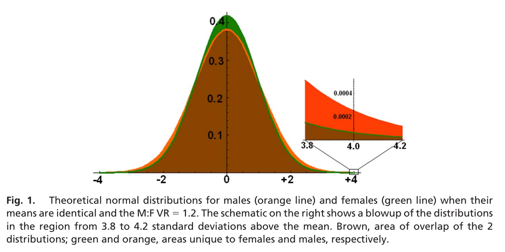

```{r setup}
library(ggplot2)
library(dplyr)
theme_set(theme_minimal(base_size = 18))
# cividis: navy, slate, gray, khaki, gold, yellow (viridisLite::cividis(9)[c(1, 3, 5, 6, 7, 9)])
navy <- "#00204D"; slate <- "#414D6B"; cgray <- "#7C7B78"; khaki <- "#9B9477"; gold <- "#BCAF6F"; yellow <- "#FFEA46"
two <- c(navy, gold)               # the two groups, wherever there are two
# charts on dark (.inverse) slides: white text on the navy background, yellow and gold for the two groups
dark <- theme(text = element_text(color = "white"), axis.text = element_text(color = "white"),
              legend.text = element_text(color = "white"), plot.title = element_text(color = "white"),
              panel.grid.major = element_line(color = slate), panel.grid.minor = element_blank(),
              plot.background = element_rect(fill = navy, color = NA),
              panel.background = element_rect(fill = navy, color = NA),
              legend.background = element_rect(fill = navy, color = NA),
              legend.key = element_rect(fill = navy, color = NA))
two_dark <- c(yellow, gold)
```

## {.inverse}

::: {.notes}
Compress: the three parts. Plan 75 in the 80: part 1 34, part 2 17, part 3 19, close 5, then 5 of slack. Dark = rush or skip; the three Freedman slides are dark to be taken at pace, not cut.

Cut order: (1) Young's rats, (2) courses and software, (3) tail ratios in other samples, (4) the most extreme item (three slides; the class simulates it).

Pace: 0:34 Freedman's Figure 1, 0:51 Schwartz, 1:06 the four steps, 1:11 calculation and interpretation, 1:15 end.
:::

### Week 2

Part 1: Mindless statistics

Part 2: Groups and individuals

Part 3: Sophisticated bigotry

# Part 1: Mindless statistics

## Cargo cult science

::: {.notes}
The story: islanders who had watched wartime airfields built runways, lit fires along them and put a man in a hut with wooden headphones. Photo from the 2024 deck.
:::

{fig-align="center" height="300"}

> "They're doing everything right. The form is perfect. It looks exactly the way it looked before. But it doesn't work. No airplanes land."

::: {.source}
Richard Feynman, "Cargo Cult Science," Caltech commencement address, 1974.
:::

## Cargo-cult statistics

::: {.notes}
Two minutes on the quotation, then three in pairs with two or three answers from the room.
:::

> "... practitioners go through the motions of fitting models, computing *p*-values or confidence intervals, or simulating posterior distributions. They invoke statistical terms and procedures as incantations, with scant understanding of the assumptions or relevance of the calculations, or even the meaning of the terminology. This demotes statistics from a **way of thinking** about evidence and **avoiding self-deception** to a formal 'blessing' of claims."

::: {.source}
Stark and Saltelli (2018), "Cargo-cult statistics and scientific crisis," *Significance* 15(4). Emphasis added.
:::

::: {.ask}
Have you seen examples?
:::

## Big science

::: {.notes}
Their section "The bigger picture": why it became the norm. Metrics, funding, publication and prestige replaced the norms of little science.
:::

> "After World War II, governments increased funding for science in response to the assessment that scientific progress is important for national security, prosperity, and quality of life. This increased the scale of science and the pool of scientific labour: science became 'big science' conducted by career professionals."

> "The norms and self-regulating aspects of 'little science'--communities that valued questioning, craftsmanship, scepticism, self-doubt, critical appraisal of the quality of evidence, and the verifiable, and verifiably replicable, advancement of human knowledge--gave way to current approaches centring on metrics, funding, publication, and prestige."

::: {.source}
Stark and Saltelli (2018), "The bigger picture."
:::

## Courses and software {.inverse}

::: {.notes}
Compress: courses teach the ritual and software performs it; both are in the reading.
:::

> "This has become the norm in many disciplines, reinforced and abetted by statistical education, statistical software, and editorial policies."

> "... many statistics courses--especially 'service' courses for non-specialists--teach cargo-cult statistics: mechanical calculations with little attention to scientific context, experimental design, assumptions and limitations of methods, or the interpretation of results."

> "The more 'powerful' and 'user-friendly' the software is, the more it invites cargo-cult statistics."

::: {.source style="color: #BCAF6F"}
Stark and Saltelli (2018).
:::

## Young's rats, 1937 {.inverse}

::: {.notes}
Skip if behind.
:::

A man named Young tried to train rats to go in at the third door along from wherever he started them. They went to the door where the food had been the time before.

He repainted the doors, changed the smell and covered the corridor. They could still tell, by how the floor sounded, until he put the corridor in sand.

Later experimenters ran rats in the old way and did not cite him,

> "... because he didn't discover anything about the rats. In fact, he discovered all the things you have to do to discover something about rats."

::: {.source style="color: #BCAF6F"}
As Feynman tells it in "Cargo Cult Science."
:::

## What can statisticians do?

::: {.notes}
Their last section. Power asymmetries and personal risk; part 3 is a politically charged case.
:::

> "Statisticians can help with important, controversial issues with immediate consequences for society. We can help fight power asymmetries in the use of evidence. We can stand up for the responsible use of statistics, even when that means taking personal risks."

> "We should be critical even when the abuses involve politically charged issues ..."

::: {.source}
Stark and Saltelli (2018), "What can statisticians do?"
:::

## Richard Feynman, 1974

::: {.notes}
What cargo cult science is missing, he says, is "a kind of utter honesty--a kind of leaning over backwards." The second quotation is last week's file drawer, in 1974. Then the lens, in week 1's words: the hypothesis, the level, the test and what to publish were all chosen by someone. The question two slides on fools most people who have passed a statistics course.
:::

> "The first principle is that you must not fool yourself--and you are the easiest person to fool."

> "If we only publish results of a certain kind, we can make the argument look good. We must publish both kinds of result. ... In other words, publication probability depends upon the answer. That should not be done."

::: {.source}
"Cargo Cult Science."
:::

**You have to choose, so choose, and defend it.** Sometimes the mathematics proves that a choice is unavoidable. Pretending it was forced is its own failure.

## The null ritual

::: {.notes}
Fisher and Neyman-Pearson disagreed; the ritual is a hybrid neither accepted. Dwell on step 1: no alternative, so no power, and last week's arithmetic needed the power.
:::

1. Set up a null hypothesis of "no mean difference" or "zero correlation." Do not specify the predictions of your own research hypothesis.
2. Use 5% as a convention for rejecting the null. If significant, accept your research hypothesis. Report the result as *p* < .05, *p* < .01, or *p* < .001, whichever comes next to the obtained *p* value.
3. Always perform this procedure.

> "Yet the null ritual does not exist in statistics proper."

::: {.source}
The three steps and the sentence are quoted from Gigerenzer and Marewski (2015), "Surrogate Science" (optional reading). "Mindless statistics" is the title of Gigerenzer (2004).
:::

## $p = 0.01$

::: {.notes}
Alone, on paper: true or false for each. Then hands for "true" on each statement in turn. No answers until all six have had hands.
:::

::: {.ask}
A treatment group and a control group, 20 people in each. A $t$ test on the difference in means gives $t = 2.7$, $p = 0.01$. True or false?
:::

::: {.small}
1. The null hypothesis has been disproved.
2. You have found the probability that the null hypothesis is true.
3. The experimental hypothesis has been proved.
4. You can deduce the probability that the experimental hypothesis is true.
5. If you reject the null hypothesis, you know the probability that you are making the wrong decision.
6. If the experiment were repeated many times, 99% of the repetitions would give a significant result.
:::

::: {.source}
After Oakes (1986) and Haller and Krauss (2002), as given in Gigerenzer (2004). Wording shortened.
:::

## Haller and Krauss (2002)

::: {.notes}
5 is 2 again. To "but that is alpha": alpha is P(reject | H0), and statement 5 is about P(H0 | reject), last week's 0.06 to 0.69. About 70% of each group believed 5.
:::

All six are false.

```{r haller_krauss, fig.height=3.0}
hk <- data.frame(
  who = factor(c("psychology students who had passed\na statistics course (44)",
                 "professors and lecturers of psychology\nnot teaching statistics (39)",
                 "people teaching statistics\nin psychology departments (30)"),
               levels = rev(c("psychology students who had passed\na statistics course (44)",
                              "professors and lecturers of psychology\nnot teaching statistics (39)",
                              "people teaching statistics\nin psychology departments (30)"))),
  pct = c(100, 90, 80))
ggplot(hk, aes(pct, who)) +
  geom_col(width = 0.6, fill = navy) +
  geom_text(aes(label = paste0(pct, "%")), hjust = 1.2, color = "white", size = 6.5) +
  scale_x_continuous(limits = c(0, 100), expand = expansion(mult = c(0, 0.02))) +
  labs(x = NULL, y = NULL, title = "Marked at least one of the six statements true") +
  theme(plot.title = element_text(size = 16), plot.title.position = "plot",
        axis.text.x = element_blank(), panel.grid = element_blank())
```

::: {.small}
1, 3: a test proves nothing. $\;$ 2, 4, 5: $p = P(|T| \ge 2.7 \mid H_0)$, which is not $P(H_0 \mid \text{data})$. $\;$ 6: the chance that a repeat is significant is its power, which $p$ does not give.
:::

::: {.source}
Six German universities. Percentages as reported in Gigerenzer (2004).
:::

## 2,347 said yes, 58 said no

::: {.notes}
Take answers from the room before the next slide.
:::

```{r yes_no, fig.height=3.1}
ggplot(data.frame(answer = factor(c("yes", "no"), levels = c("yes", "no")), n = c(2347, 58)),
       aes(answer, n)) +
  geom_col(width = 0.55, fill = navy) +
  geom_text(aes(label = format(n, big.mark = ",")), vjust = -0.4, size = 7) +
  scale_y_continuous(expand = expansion(mult = c(0, 0.15))) +
  labs(x = NULL, y = NULL) +
  theme(axis.text.y = element_blank(), panel.grid = element_blank(), axis.text.x = element_text(size = 20))
```

::: {.small}
An Internet study asked: "Do you feel there is a difference between altruism and heroism?"
:::

::: {.ask}
What would you report?
:::

## Mindless statistical inference

::: {.notes}
Ask which null hypothesis was tested: an equal chance of yes and no; 1202.5 is half of 2,405. Their other example: two identical group means, and a $t$ test anyway.
:::

> "... there is a significant perceived difference between the ideas of heroism and altruism, $\chi^2(1) = 2178.60$, $p < .0001$."

$$\frac{(2347 - 1202.5)^2}{1202.5} + \frac{(58 - 1202.5)^2}{1202.5} = 2178.6$$

> "One of us reviewed an article in which the number of subjects was reported as 57. The authors calculated that the 95% confidence interval was between 47.3 and 66.7 subjects. ... The only numbers with no confidence intervals or *p* values attached were the page numbers."

::: {.source}
The first is Franco, Blau and Zimbardo (2011) as quoted by Gigerenzer and Marewski (2015); the second is Gigerenzer and Marewski's own.
:::

## Have you had courses taught that way?

::: {.notes}
Groups of three or four, then the room. No house answer. Stark and Saltelli's causes, for afterward: courses, software, editorial policies, science as a career.
:::

> "Statistical methods are not simply applied to a discipline; they change the discipline itself, and vice versa."

::: {.source}
Gigerenzer and Marewski (2015).
:::

::: {.ask}
How were $p$-values and confidence intervals taught and assessed in your degree?

What are the causes, and what would you change?
:::

# Part 2: Groups and individuals

## Freedman (1999), Figure 1 {.inverse}

::: {.notes}
Compress: they read this in section 3. Pairs for one minute, then the two numbers from the room and why each end of the line is read that way.
:::

:::: {.columns}
::: {.column width="58%"}
{height="520"}
:::
::: {.column width="42%"}
::: {.source style="color: #BCAF6F"}
Each point is a US state. March 1995 Current Population Survey, people aged 25 and over. High income: family income of \$50,000 or more. From "Ecological Inference and the Ecological Fallacy," Technical Report 549.
:::

The line is $y = 0.29 + 0.56\,x$.

::: {.ask}
According to the line, what fraction of the native-born have high incomes? Of the foreign-born?
:::
:::
::::

## The regression and the survey {.inverse}

::: {.notes}
Compress: the survey asked people; the line has the order reversed and one number wrong by 57 points. In the richer states the native-born have higher incomes too, so the slope measures how states differ.
:::

:::: {.columns}
::: {.column width="54%"}
```{r freedman_bars, fig.width=5.2, fig.height=4.6}
tab2 <- data.frame(
  method = factor(rep(c("survey\n(truth)", "the line in\nFigure 1"), each = 2),
                  levels = c("survey\n(truth)", "the line in\nFigure 1")),
  group = factor(rep(c("native-born", "foreign-born"), 2), levels = c("native-born", "foreign-born")),
  pct = c(35, 28, 29, 85))
ggplot(tab2, aes(method, pct, fill = group)) +
  geom_col(position = position_dodge(0.8), width = 0.75) +
  geom_text(aes(label = paste0(pct, "%")), position = position_dodge(0.8), vjust = -0.4, size = 6, color = "white") +
  scale_fill_manual(values = two_dark, name = NULL) +
  coord_cartesian(ylim = c(0, 95)) +
  labs(x = NULL, y = NULL, title = "Percent with high income") +
  dark + theme(legend.position = "bottom", plot.title = element_text(size = 16), plot.title.position = "plot")
```
:::
::: {.column width="46%"}
Reading the two ends of the line as the two groups' rates assumes that neither rate depends on how many immigrants a state has.

::: {.small}
> "Immigration to the USA tends to concentrate in richer states--California, Hawaii and New York rather than Kentucky, Tennessee and West Virginia."
:::

::: {.source style="color: #BCAF6F"}
Numbers and quotation from Freedman (1999), sections 1 and 3.
:::
:::
::::

## Ecological and individual correlations {.inverse}

::: {.notes}
Compress: Robinson's example is in Freedman's section 1; Freedman's is the replication with 1995 data. Both correlations are correct and answer different questions. After the quotation, say it: this is also an example of Simpson's paradox.
:::

```{r two_correlations, fig.height=2.75}
cors <- data.frame(
  example = rep(c("Robinson (1950): literacy, 1930", "Freedman (1999): high income, 1995"), each = 2),
  level = factor(rep(c("correlation across states", "correlation across people"), 2),
                 levels = c("correlation across states", "correlation across people")),
  r = c(0.53, -0.11, 0.52, -0.05))
ggplot(cors, aes(level, r, group = example, color = example)) +
  geom_hline(yintercept = 0, linetype = "dotted", color = "white") +
  geom_line(linewidth = 1.2) + geom_point(size = 4) +
  geom_text(aes(label = sprintf("%.2f", r)), color = "white", size = 6,
            hjust = c(1.4, -0.4, 1.4, -0.4), vjust = c(-0.6, 1.6, 1.6, -0.6)) +
  scale_color_manual(values = two_dark, name = NULL) +
  coord_cartesian(ylim = c(-0.32, 0.7)) +
  labs(x = NULL, y = NULL) +
  dark + theme(legend.position = "bottom", legend.direction = "horizontal")
```

> "The ecological fallacy consists in thinking that relationships observed for groups necessarily hold for individuals."

This is also an example of Simpson's paradox.

::: {.source style="color: #BCAF6F"}
Freedman (1999).
:::

## $R^2$: definition and common misreadings

::: {.notes}
With slope and noise fixed, R-squared rises with the spread of X. Hill's strength was a ratio of rates: 200 for chimney sweeps, 9 to 10 for smokers. Freedman's line had the wrong slope; the next two slides have the right slope and a fit that still misleads.
:::

:::: {.columns}
::: {.column width="45%"}
$$R^2 = 1 - \frac{\sum_i (y_i - \hat y_i)^2}{\sum_i (y_i - \bar y)^2}$$

::: {.small}
The share of the variation in $y$, among the units in the regression, that the fitted values account for. With one predictor it is the squared correlation: $0.52^2 = 0.27$ for the fifty states.

Fitted line, slope $\hat\beta$, residual variance $\hat\sigma^2$:
:::

$$R^2 = \frac{\hat\beta^2\, \widehat{\operatorname{Var}}(X)}{\hat\beta^2\, \widehat{\operatorname{Var}}(X) + \hat\sigma^2}$$
:::
::: {.column width="55%"}
1. "A high $R^2$ means the model is right."
2. "A high $R^2$ means a strong association, so a cause is more likely."
3. "A high $R^2$ means we can predict each person well."

> "First upon my list I would put the strength of the association."

::: {.source}
Bradford Hill (1965), "The Environment and Disease: Association or Causation?" His measure of strength was a ratio of rates.
:::
:::
::::

## Fifty area averages

::: {.notes}
Hands: below 0.3, between 0.3 and 0.7, above 0.7. The next slide has the same fifty points with the axes widened to fit the people.
:::

```{r sim_areas}
set.seed(7)
J <- 50; n <- 100; beta <- 1
area_mean_x <- rnorm(J, 0, 1)
people <- data.frame(area = rep(1:J, each = n)) |>
  mutate(X = area_mean_x[area] + rnorm(J * n, 0, 2),
         Y = beta * X + rnorm(J * n, 0, sqrt(20)))
areas <- people |> group_by(area) |> summarize(X = mean(X), Y = mean(Y))
r2 <- c(people = summary(lm(Y ~ X, people))$r.squared,
        areas = summary(lm(Y ~ X, areas))$r.squared)
lims <- list(x = range(people$X), y = range(people$Y))
```

```{r plot_areas_only, fig.height=3.7}
ggplot(areas, aes(X, Y)) +
  geom_point(color = navy, size = 2.5) +
  geom_smooth(method = "lm", se = FALSE, color = navy, linewidth = 0.8) +
  labs(title = sprintf("Simulated: 50 areas, each point an average of 100 people. R-squared %.2f", r2[2])) +
  theme(plot.title = element_text(size = 15))
```

::: {.ask}
The line through the 5,000 people has the same slope. What is its $R^2$?
:::

## The same fifty areas and their people

::: {.notes}
One simulated draw; the population values are 0.20 and 0.84. The three misreadings two slides back, answered: the line through the people is the model that generated them, and its R-squared is 0.19; the effect of X is the same at both levels, averaging only removed variation; a person's Y is no easier to predict.
:::

```{r plot_people, fig.height=4.1}
ggplot(people, aes(X, Y)) +
  geom_point(alpha = 0.10, size = 0.7, color = cgray) +
  geom_point(data = areas, color = navy, size = 2.5) +
  geom_smooth(method = "lm", se = FALSE, color = khaki, linewidth = 1) +
  geom_smooth(data = areas, method = "lm", se = FALSE, color = navy, linewidth = 0.8) +
  coord_cartesian(xlim = lims$x, ylim = lims$y) +
  labs(title = sprintf("R-squared: people %.2f, area averages %.2f. The two lines nearly coincide.", r2[1], r2[2])) +
  theme(plot.title = element_text(size = 15))
```

::: {.small}
Slope 1 at both levels. $R^2$: $\tfrac{5}{5 + 20} = 0.20$ among people, $\tfrac{1.04}{1.04 + 0.2} = 0.84$ across averages of 100.
:::

## Strength of association, at which level?

::: {.notes}
Hill's strength is a heuristic, one of nine viewpoints. His examples compared rates among people: sweeps, smokers. The R-squared values are the last slide's: 0.20 among people, 0.84 across averages of 100.
:::

Hill's strength of association is a heuristic. His examples compared rates among people: a ratio of 200 for chimney sweeps, 9 to 10 for smokers.

If a cause acts on people, look for the association among people, and not only among their averages.

In this simulation, averaging raises $R^2$ while leaving the population slope unchanged. A strong association between area averages does not establish a causal effect among individuals.

::: {.source}
Hill (1965): "we must not be too ready to dismiss a cause-and-effect hypothesis merely on the grounds that the observed association appears to be slight."
:::

## Statistical discrimination

::: {.notes}
The name is from economics: Phelps (1972), Arrow (1973). The two numbers are for normal curves with equal spreads and means half a standard deviation apart.
:::

A decision about a person, made from the average of a group they belong to.

```{r stat_disc, fig.height=2.7}
xs <- seq(-3.5, 4, by = 0.01)
sd_df <- rbind(data.frame(x = xs, density = dnorm(xs, 0, 1), group = "group 1"),
               data.frame(x = xs, density = dnorm(xs, 0.5, 1), group = "group 2"))
ggplot(sd_df, aes(x, density, fill = group)) +
  geom_area(position = "identity", alpha = 0.55, color = NA) +
  geom_vline(xintercept = c(0, 0.5), linetype = "dashed", color = c(gold, navy), linewidth = 0.9) +
  scale_fill_manual(values = c(gold, navy), name = NULL) +
  scale_x_continuous(breaks = -3:4) +
  labs(x = "standard deviations", y = NULL,
       title = "Two groups of equal size whose means differ by half a standard deviation") +
  theme(plot.title = element_text(size = 15), axis.text.y = element_blank(),
        panel.grid = element_blank(), legend.position = "right")
```

Group membership accounts for 6% of the variance. Take one person from each group at random: the one from the group with the lower mean is the higher of the two 36% of the time.

## Decisions from group averages

::: {.notes}
Pairs, then the room. No house answer. Cases if the room is stuck: an insurer pricing a driver by age or postcode; a lender deciding by neighborhood; a doctor quoting a survival rate to one patient.
:::

The errors fall on the people who differ from their group's average.

If the average is the result of past exclusion, deciding by it continues the exclusion.

::: {.ask}
Is an aggregate claim about a group ever a claim about a member of it?

Give one case where you think it is and one where it is not.
:::

# Part 3: Sophisticated bigotry

## Jacob Schwartz, 1962

::: {.notes}
Part 1 was statistics without thought. Schwartz is about mathematics that makes a weak argument persuasive. From the 2022 notes for this week.
:::

> "... the simple-mindedness of mathematics--its willingness, like that of a computing machine, to elaborate upon any idea, however absurd; to dress scientific brilliancies and scientific absurdities alike in the impressive uniform of formulae and theorems. Unfortunately however, an absurdity in uniform is far more persuasive than an absurdity unclad."

> "The result, perhaps most common in the social sciences, is bad theory with a mathematical passport."

::: {.source}
"The Pernicious Influence of Mathematics on Science."
:::

## Lawrence Summers, 14 January 2005

::: {.notes}
Read it out. The last sentence is the calculation.
:::

> "There are issues of intrinsic aptitude, and particularly of the variability of aptitude, and that those considerations are reinforced by what are in fact lesser factors involving socialization and continuing discrimination. It's talking about people who are 3½, 4 standard deviations above the mean in the one-in-5,000, one-in-10,000 class. Even small differences in the standard deviation will translate into very large differences in the available pool substantially out."

::: {.source}
Then president of Harvard, on why few women hold tenured posts in science and engineering. At a National Bureau of Economic Research conference, as quoted by Hyde and Mertz (2009), who present it as a statement of the Greater Male Variability Hypothesis.
:::

## Same mean, variance ratio 1.2

::: {.notes}
Each person writes a number, then hands: over 40%, 25 to 40%, under 25%. The answer is on the slide after next.
:::

Two groups of equal size, each normally distributed, with the same mean.

One has a variance 20% larger, which is a standard deviation about 10% larger.

::: {.ask}
Take the people more than 4 standard deviations above the mean, where the standard deviation is that of the two groups combined. What share of them comes from the lower-variance group?
:::

## Hyde and Mertz (2009), Figure 1

::: {.notes}
In the middle the two curves nearly coincide. They separate only in the inset. The ten-state data behind the ratio of 1.2 are the paper's Table 1, in the notes: means at most 0.06 standard deviations apart, variance ratios 1.11 to 1.21.
:::

{fig-align="center" height="515"}

::: {.source}
Equal means and a variance ratio of 1.2; the inset is the region from 3.8 to 4.2 standard deviations. "Gender, culture, and mathematics performance," *PNAS* 106(22), 8801--8807.
:::

## Share above a cutoff

::: {.notes}
The answer to the guess is 18%. Normal curves, equal group sizes, pooled standard deviations, as in the paper. Four standard deviations is 1 person in 26,000, far beyond where the curves were fitted.
:::

```{r tail_share, fig.height=4.0}
share_low <- function(c, vr, d) {
  sf <- sqrt(2 / (1 + vr)); sm <- sqrt(2 * vr / (1 + vr))
  pm <- pnorm(c, d / 2, sm, lower.tail = FALSE); pf <- pnorm(c, -d / 2, sf, lower.tail = FALSE)
  pf / (pm + pf)
}
cs <- seq(0, 5, by = 0.02)
curves <- rbind(
  data.frame(c = cs, share = share_low(cs, 1.2, 0), case = "equal means, variance ratio 1.2 (Figure 1)"),
  data.frame(c = cs, share = share_low(cs, 1.12, 0.05), case = "means 0.05 SD apart, variance ratio 1.12 (the text)"))
marks <- data.frame(c = c(3.105, 4, 5), share = c(share_low(3.105, 1.12, 0.05), share_low(4, 1.2, 0), share_low(5, 1.2, 0)),
                    lab = c("99.9th percentile: 32%", "4 SD, 1 person in 26,000: 18%", "5 SD, 1 in 2.2 million: 9%"))
ggplot(curves, aes(c, share)) +
  geom_hline(yintercept = 0.5, linetype = "dotted") +
  geom_line(aes(color = case), linewidth = 1.2) +
  geom_point(data = marks, size = 3.5, color = navy) +
  geom_label(data = marks, aes(label = lab), hjust = c(0, 1, 1), nudge_x = c(0.1, -0.12, -0.12),
             nudge_y = c(0.04, -0.035, -0.035), size = 5.5, label.size = 0, fill = "white", alpha = 0.85) +
  scale_color_manual(values = c(navy, khaki), name = NULL) +
  scale_y_continuous(labels = scales::percent, limits = c(0, 0.55)) +
  scale_x_continuous(breaks = 0:5, expand = expansion(mult = c(0.03, 0.05))) +
  labs(x = "cutoff, in standard deviations above the mean",
       y = "lower-variance group's share\nof those above the cutoff") +
  theme(legend.position = "top", legend.direction = "vertical", legend.justification = "left",
        legend.margin = margin(0, 0, 0, 0), legend.box.margin = margin(0, 0, -5, 0),
        axis.title.y = element_text(size = 15))
```

::: {.source}
The marked shares are the paper's own. The fractions of everyone beyond each cutoff are computed from Figure 1's values; the paper calls the two cutoffs the 1-in-20,000 and 1-in-one million levels.
:::

## Hyde and Mertz (2009), Table 2

::: {.notes}
The variance ratio by country: above 1 in most, 0.99, 1.00 and 0.95 in three. This challenges a universal ratio; it does not by itself exclude an intrinsic contribution. Machin and Pekkarinen, whose figures these are, found it significantly above 1 in 34 of the 40 countries in PISA 2003.
:::

:::: {.columns}
::: {.column width="34%"}
{height="500"}
:::
::: {.column width="66%"}
```{r vr_countries, fig.width=6.8, fig.height=5.0}
pisa <- data.frame(
  country = c("Canada", "Czech Rep.", "Denmark", "Germany", "Iceland", "Indonesia",
              "Ireland", "Mexico", "Netherlands", "Thailand", "Tunisia", "Russian Fed.",
              "Switzerland", "UK", "USA"),
  vr = c(1.24, 1.07, 0.99, 1.12, 1.24, 0.95, 1.07, 1.08, 1.00, 1.10, 1.03, 1.20, 1.11, 1.06, 1.19),
  sig = c(TRUE, FALSE, FALSE, TRUE, TRUE, TRUE, FALSE, TRUE, FALSE, TRUE, FALSE, TRUE, TRUE, TRUE, TRUE))
ggplot(pisa, aes(vr, reorder(country, vr), shape = sig)) +
  geom_vline(xintercept = 1, linetype = "dotted") +
  geom_point(size = 3.2, color = navy) +
  scale_shape_manual(values = c(1, 16), labels = c("not significantly different from 1", "significantly different from 1 (P < 0.05)"), name = NULL) +
  labs(x = "variance ratio, boys / girls, PISA 2003", y = NULL) +
  theme(legend.position = "bottom", legend.direction = "vertical")
```
:::
::::

## Tail ratios in other samples {.inverse}

::: {.notes}
Compress: 2.06 boys per girl among white students and 0.91 among Asian-American students in one state; the talent search ratio fell from 13 to 2.8 in 25 years.
:::

```{r other_samples, fig.height=3.9}
oth <- data.frame(
  panel = rep(c("Minnesota state test:\nboys per girl above the 99th percentile",
                "Talent search: boys per girl with\nSAT-M of 700 or more before age 13"), each = 2),
  who = factor(c("white\nstudents", "Asian-American\nstudents", "1980 to 1982", "2005"),
               levels = c("white\nstudents", "Asian-American\nstudents", "1980 to 1982", "2005")),
  ratio = c(2.06, 0.91, 13, 2.8))
ggplot(oth, aes(who, ratio)) +
  geom_col(width = 0.6, fill = "#E0CB5E") +
  geom_hline(yintercept = 1, linetype = "dotted", color = "white") +
  geom_text(aes(label = ratio), vjust = -0.4, size = 6, color = "white") +
  facet_wrap(~panel, scales = "free") +
  scale_y_continuous(expand = expansion(mult = c(0, 0.15))) +
  labs(x = NULL, y = NULL) +
  theme(strip.text = element_text(size = 15, color = "white"),
        text = element_text(color = "white"), axis.text = element_text(color = "white"),
        panel.grid.major = element_line(color = slate), panel.grid.minor = element_blank(),
        plot.background = element_rect(fill = navy, color = NA),
        panel.background = element_rect(fill = navy, color = NA))
```

::: {.source style="color: #BCAF6F"}
Numbers as reported by Hyde and Mertz (2009). Dotted line: one boy per girl.
:::

## Which step would you question?

::: {.notes}
Pairs write the steps first, then three or four answers. No house answer. Stark and Saltelli's "whether or not we like the conclusion" applies to Hyde and Mertz's 32% as much as to Summers's sentence. The four steps are on the next slide; take the room's list before showing it.
:::

The variance argument has a correct calculation in it.

::: {.ask}
Write down the steps from the calculation to the conclusion. At which step, if any, does the argument fail? What evidence would change your mind?

Does "bigotry" describe any of the steps? Which?
:::

## Assumptions at each step

::: {.notes}
After the pairs: which of these did the room name. Only step 1 is a calculation, and it is correct. Hyde and Mertz use steps 1 and 2 themselves, for their 32%. Step 3 is a causal claim. Step 4 is part 2's statistical discrimination; Summers's sentence does not take it.
:::

| Step | What it assumes |
|:-------------|:--------------------------|
| 1. From test scores to a share of a tail | Normal curves, fitted where the data are, hold four standard deviations out. The variance ratio and the mean difference are those of the population in question. The two groups are the same size. |
| 2. From a share of a tail to a share of a profession | The test measures what the work needs. The profession draws from beyond that cutoff. Among people beyond it, the two groups enter the profession at the same rate. |
| 3. From a share to "intrinsic" | The difference in variance has an intrinsic cause. That needs causal evidence that distinguishes the explanations. Ratios that vary by country challenge a universal ratio; they do not by themselves exclude an intrinsic contribution. |
| 4. From a share of a profession to one applicant | A person can be judged from their group's share. |

Only step 1 is a calculation. The quotation stops at step 3.

## The most extreme item from each group

::: {.notes}
Guesses from the room. The answer is on the next slide.
:::

A feed that ranks items shows the far end of a distribution too.

Two groups post items. Each item's extremity is an independent draw from the same distribution.

One group posts 100 items a day, the other 10,000.

::: {.ask}
A feed shows you the single most extreme item from each group. How often is the larger group's item the more extreme of the two?
:::

## One simulated day

::: {.notes}
Both groups are draws from the same standard normal.
:::

```{r feed_strip, fig.height=3.7}
set.seed(4)
feed <- rbind(data.frame(group = "100 items", x = rnorm(100)),
              data.frame(group = "10,000 items", x = rnorm(10000)))
tops <- feed |> group_by(group) |> slice_max(x, n = 1)
ggplot(feed, aes(x, group)) +
  geom_jitter(height = 0.28, width = 0, alpha = 0.18, size = 0.7, color = slate) +
  geom_point(data = tops, shape = 21, fill = yellow, color = navy, size = 5, stroke = 1.5) +
  geom_text(data = tops, aes(label = sprintf("%.1f", x)), vjust = -1.6, color = navy, size = 6) +
  labs(x = "extremity, in standard deviations from the typical item", y = NULL,
       title = "Circled: the one item the feed shows from each group.") +
  theme(plot.title = element_text(size = 16))
```

::: {.small}
Both groups draw from the same distribution. Each of the 10,100 items is equally likely to be the most extreme, so the larger group's item is the more extreme of the two with probability $10{,}000/10{,}100 = 0.99$.
:::

## The largest of $n$

::: {.notes}
All $n$ draws are below $x$ with probability $F(x)^n$. Uniform by hand; normal from the values. The far end of a distribution moves with the size of the group and its spread as well as its center.
:::

:::: {.columns}
::: {.column width="42%"}
::: {.small}
$P(M_n \le x) = F(x)^n$

Uniform$(0,1)$: $\;E[M_n] = \dfrac{n}{n+1}$

Normal: $\;E[M_n] = \mu + \sigma\,m_n$

$m_{100} = 2.51$

$m_{1000} = 3.24$

$m_{10{,}000} = 3.85$
:::
:::
::: {.column width="58%"}
```{r emax, fig.width=5.2, fig.height=3.9}
Emax <- function(n) integrate(function(x) x * n * pnorm(x)^(n - 1) * dnorm(x), -10, 12, rel.tol = 1e-9)$value
ns <- 10^seq(1, 5, by = 0.25)
em <- sapply(ns, Emax)
rbind(data.frame(n = ns, m = em, spread = "standard deviation 1"),
      data.frame(n = ns, m = 1.1 * em, spread = "standard deviation 1.1")) |>
  ggplot(aes(n, m, color = spread)) + geom_line(linewidth = 1.2) +
  scale_x_log10(breaks = 10^(1:5), labels = scales::comma) +
  scale_color_manual(values = c(navy, khaki), name = NULL) +
  labs(x = "n (log scale)", y = NULL, title = "Expected largest of n normal draws, mean 0") +
  theme(plot.title = element_text(size = 15), legend.position = "bottom")
```
:::
::::

::: {.small}
$P(M_{1000} > 3) = 1 - \Phi(3)^{1000} = 0.74$, $\quad P(M_{100} > 3) = 1 - \Phi(3)^{100} = 0.13$
:::

## Calculation and interpretation

::: {.notes}
Each number was computed correctly. Getting from the middle column to the right-hand one needs more than the calculation: power and the share of real effects; data on people; the assumptions of steps 1 and 2.
:::

::: {style="font-size: 1.25em"}
| | The calculation gives | It is read as |
|:---------|:---------------|:---------------|
| $p = 0.01$ | how often data this extreme occur when the null hypothesis is true | the chance that the null hypothesis is true |
| a correlation of 0.52 | a relationship across fifty states | a relationship among the people in them |
| an 18% share of a tail | a share of the tail area under two normal curves | the "available pool" for a profession |
:::

## Lenses this week

::: {.notes}
The first lens covers both halves of the title. Then the two questions on the next slide.
:::

- **You have to choose, so choose, and defend it.** "Pretending it was forced is its own failure." In the null ritual nobody chose the hypothesis, the level or the test. In the variance argument the first step is a correct calculation, and the steps after it are stated as if they followed from it.
- **What are we optimizing or predicting?** A state's rate, or a person's. A group's average, or one of its members.
- **Who is in the data?** Under the two normal curves, 1 person in 26,000 is four standard deviations out. Fifteen-year-olds in one country or another, with a variance ratio from 0.95 to 1.24.

...and why?

##

::: {.notes}
A show of hands on the second question for each case, and one reason from each side. No house answer.
:::

> **Who benefited from that choice being invisible?**
> **And would a more competent analyst have chosen differently?**

::: {.ask}
Put both questions to the null ritual. Then to the variance argument.
:::
